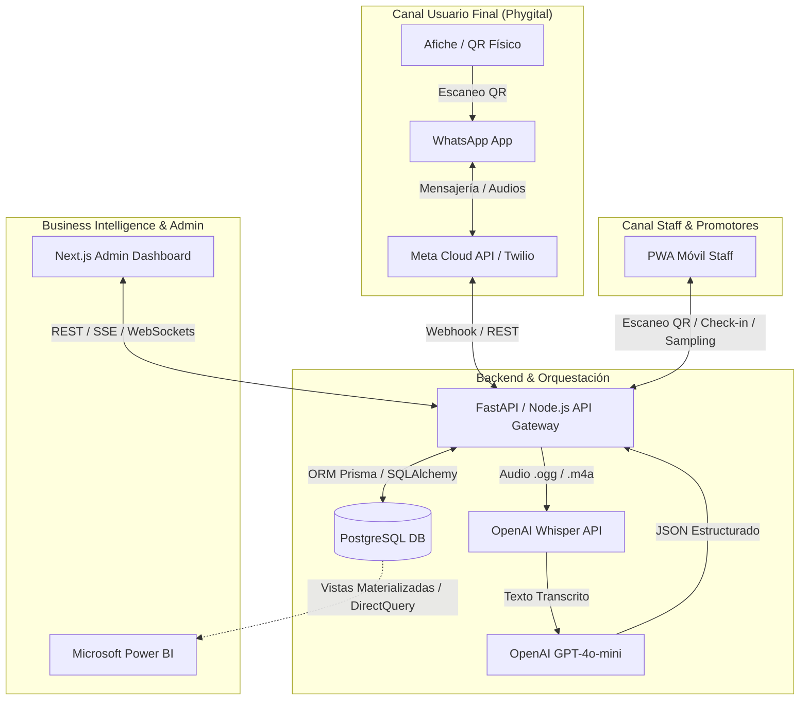
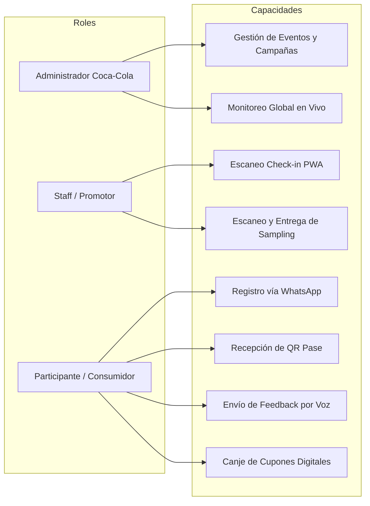
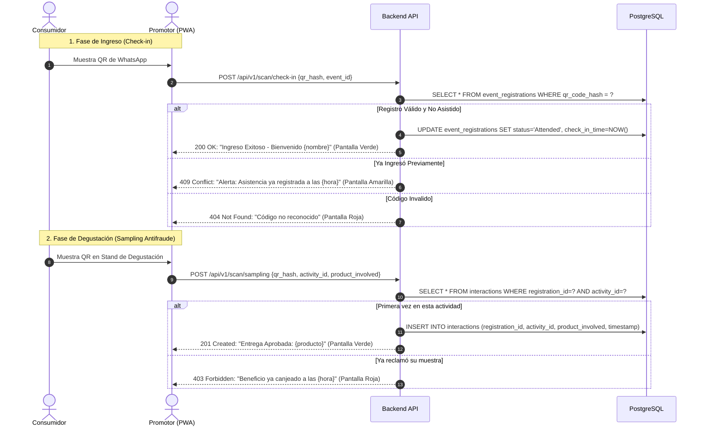
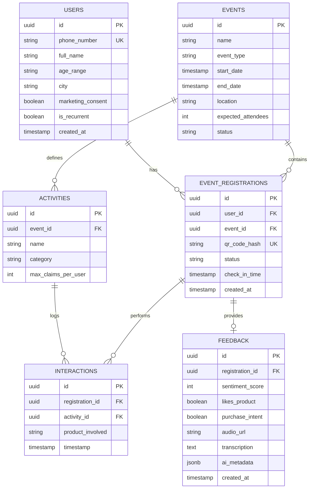
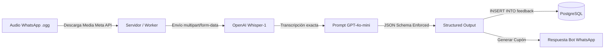

# Coca-Cola Event Intelligence 🥤📊
### Plataforma Phygital End-to-End para Medición de Impacto, Trazabilidad en Tiempo Real e Inteligencia de Audiencia

---

## 1. Resumen Ejecutivo & Propuesta de Valor

### 1.1 Contexto y Problemática
En la actualidad, Coca-Cola ejecuta cientos de eventos experienciales de alto impacto (festivales de música, activaciones de marca, lanzamientos de nuevos productos como Coca-Cola Creations o líneas Zero, eventos deportivos y pop-up stores). No obstante, la medición del Retorno de Inversión (ROI) y la retención real de consumidores presenta fallas estructurales:
* **Fragmentación de Datos:** Registros manuales en planillas, formularios impresos o bases de datos aisladas que no se consolidan en tiempo real.
* **Fricción de Entrada:** Las aplicaciones móviles nativas tradicionales sufren tasas de rebote superiores al 80% por la resistencia del usuario a descargar una app solo para un evento de pocas horas.
* **Pérdida de Trazabilidad:** Dificultad para auditar si una misma persona canjeó múltiples muestras (*sampling abuse*) o para saber qué actividades tuvieron mayor interacción dentro del recinto.
* **Feedback Cualitativo Sesgado:** Encuestas post-evento con tasas de respuesta menores al 3% y preguntas cerradas que no capturan la emoción genuina del consumidor.

### 1.2 Objetivo del Sistema
**Coca-Cola Event Intelligence** centraliza el ciclo de vida completo del evento (Antes, Durante y Después) transformando cada contacto físico en datos estructurados y analítica accionable disponible al instante mediante dashboards interactivos y vistas optimizadas para Microsoft Power BI.

### 1.3 El Factor "Wow": Experiencia Phygital Conversacional con IA
* **Cero descargas:** Todo el viaje del asistente ocurre a través de **WhatsApp**, la herramienta de mensajería más extendida del mundo.
* **Pase Digital Dinámico:** Generación instantánea de credenciales con códigos QR únicos y seguros.
* **Sampling Antifraude:** Staff provisto de una PWA offline-first con escáner de alta velocidad y control estricto de beneficios individuales.
* **Voz a Datos con IA (Audio-to-Insights):** En lugar de aburridas encuestas tipo Likert, el consumidor envía un audio informal por WhatsApp al salir. Whisper y GPT-4o-mini transcriben, analizan el sentimiento, extraen insights de sabor/marca y devuelven un incentivo personalizado (cupón digital).

---

## 2. Arquitectura General del Sistema



---

## 3. Tech Stack Recomendado

| Capa | Tecnología | Justificación Técnica |
| :--- | :--- | :--- |
| **Frontend Admin & PWA Staff** | **Next.js 14+ (App Router), React, Tailwind CSS, shadcn/ui** | Soporte PWA rápido, renderizado híbrido (SSR/Client), scanner HTML5 QR nativo y diseño responsivo para smartphones de promotores. |
| **Backend & Microservicios** | **Python (FastAPI)** o **Node.js (NestJS / Express)** | *Recomendación:* **FastAPI** por su concurrencia nativa asíncrona (`asyncio`), tipado estricto con Pydantic y soporte nativo para el procesamiento de audio y llamadas asíncronas a OpenAI. |
| **Base de Datos Principal** | **PostgreSQL 15+** | Robustez relacional, soporte nativo de UUID, índices B-Tree/GIN para alta concurrencia y vistas materializadas para Power BI. |
| **ORM & Migraciones** | **Prisma** (Node.js) o **SQLAlchemy 2.0 + Alembic** (Python) | Esquemas declarativos fuertemente tipados, control de migraciones y consultas optimizadas. |
| **Canal Conversacional** | **Meta WhatsApp Business Cloud API** (o Twilio Messaging API) | Envío y recepción de mensajes de texto, botones interactivos, plantillas y archivos multimedia (voz). |
| **Motor de Inteligencia Artificial** | **OpenAI API (Whisper-1 + GPT-4o-mini)** | `Whisper-1` para conversión de audio WhatsApp a texto multilingüe. `GPT-4o-mini` con *Structured Outputs* (JSON Schema) para análisis de sentimiento, intención de compra y tags de producto. |
| **Almacenamiento Temporal de Medios** | **AWS S3** o **Supabase Storage** | Almacenamiento seguro de notas de voz temporales y códigos QR generados. |
| **Analítica & BI** | **Microsoft Power BI (DirectQuery / Scheduled Refresh)** | Modelado dimensional conectado a vistas de PostgreSQL para reportes ejecutivos de marca. |

---

## 4. Roles y Matriz de Permisos (RBAC)



1. **Administrador de Marca / Operaciones (Admin Dashboard):**
   * Creación, edición y configuración de eventos, aforos y metas de asistencia.
   * Definición de catálogo de actividades (Check-in, Stand Sampling Zero, Photocall, Stand Freestyle).
   * Visualización de métricas en tiempo real (asistencia, ritmo de entregas, sentimiento por hora).
   * Conexión y exportación de datos para Power BI.
2. **Staff / Promotor de Terreno (PWA Móvil):**
   * Autenticación simplificada con PIN o sesión de staff vinculada a un evento específico.
   * Modo Escáner de Cámara para validación ultrarrápida de QR (< 1 segundo por persona).
   * Registro del tipo de producto degustado (`Coca-Cola Original`, `Zero Azúcar`, `Creations`, etc.).
   * Alertas visuales y sonoras inmediatas: **Éxito (Verde)**, **Ya Ingresó (Amarillo)**, **Fraude / Ya Canjeado (Rojo)**.
3. **Participante / Consumidor (WhatsApp):**
   * Onboarding conversacional sin formularios web complejos.
   * Portabilidad de su código QR en el historial de chat de WhatsApp.
   * Envío natural de impresiones y sugerencias por nota de voz.
   * Recepción de incentivos directos (cupones de descuento, códigos de canje en retail/e-commerce).

---

## 5. Especificación Detallada de Flujos de Interacción

### 5.1 Flujo 1: Antes del Evento (Registro, Segmentación y QR Pase)
1. **Punto de Contacto:** El consumidor escanea un código QR en vía pública, redes sociales o punto de venta que contiene un enlace `wa.me/XXXXXXXXXXX?text=Hola%20CocaCola%20Festival`.
2. **Interacción con el Bot:**
   * El bot saluda con el tono de voz de Coca-Cola (cálido, enérgico, optimista).
   * Solicita confirmación de:
     * Nombre completo.
     * Rango de edad (ej. `<18`, `18-24`, `25-34`, `35+`).
     * Ciudad / Comuna de residencia.
     * Checkbox conversacional de Consentimiento de Políticas de Privacidad y Marketing.
3. **Lógica de Backend:**
   * Busca si el número telefónico existe en `users`. Si ya existe, actualiza datos y marca `is_recurrent = true`.
   * Verifica aforo disponible en `events`.
   * Crea el registro en `event_registrations` con un hash único criptográfico (`SHA-256` o firmado con `HMAC-SHA256`).
   * Genera el archivo de imagen del código QR (PNG/SVG).
4. **Respuesta al Usuario:** El bot entrega la confirmación junto a la imagen del QR y recomendaciones para el evento.

### 5.2 Flujo 2: Durante el Evento (Check-in, Trazabilidad y Antifraude)



### 5.3 Flujo 3: Post-Evento (Encuesta por Voz, Pipeline NLP e Incentivo)
1. **Disparador:** Job programado o evento cron que detecta que han transcurrido $T+30$ minutos desde la última actividad o el cierre del evento.
2. **Mensaje de WhatsApp Proactivo:**
   > *"¡Hola {Nombre}! 🎉 Gracias por acompañarnos hoy en {Nombre_Evento}. Queremos saber tu opinión real: mándanos una nota de voz breve (15-30 seg) contándonos qué te pareció la nueva Coca-Cola Zero y qué fue lo que más disfrutaste."*
3. **Recepción del Audio:**
   * El webhook de WhatsApp recibe el payload con el `media_id` del archivo de audio (formato `.ogg` Opus o `.m4a`).
   * El backend descarga el binario del audio mediante la API de Meta.
4. **Pipeline de Inteligencia Artificial:**
   * **Paso A (Whisper API):** Transcripción fonética a texto con soporte para modismos locales y acentos.
   * **Paso B (GPT-4o-mini con Structured JSON):**
     * `sentiment_score`: Valor numérico del 1 al 5.
     * `likes_product`: Booleano (`true`/`false`).
     * `purchase_intent`: Booleano (indica si el consumidor manifiesta que compraría el producto en su día a día).
     * `key_topics`: Tags de sabor, temperatura, dulzura, experiencia general.
     * `executive_quote`: Cita textual más relevante del consumidor.
5. **Persistencia & Recompensa Dinámica:**
   * El registro se guarda en la tabla `feedback`.
   * Si el sentimiento es positivo ($\ge 3$), el bot agradece y envía un cupón promocional:
     > *"¡Nos alegra un montón que lo hayas disfrutado! 🎁 Aquí tienes un cupón exclusivo de 30% de descuento para tu próximo pack de Coca-Cola Zero: [CUPON-ZERO-2026]."*

---

## 6. Modelo de Datos (PostgreSQL & Prisma)

### 6.1 Diagrama Entidad-Relación (ERD)



### 6.2 Script DDL PostgreSQL

```sql
-- Habilitar extensión para UUIDs
CREATE EXTENSION IF NOT EXISTS "uuid-ossp";

-- 1. Tabla de Usuarios (Consumidores)
CREATE TABLE users (
    id UUID PRIMARY KEY DEFAULT uuid_generate_v4(),
    phone_number VARCHAR(25) NOT NULL UNIQUE,
    full_name VARCHAR(150) NOT NULL,
    age_range VARCHAR(20) NOT NULL,
    city VARCHAR(100) NOT NULL,
    marketing_consent BOOLEAN NOT NULL DEFAULT FALSE,
    is_recurrent BOOLEAN NOT NULL DEFAULT FALSE,
    created_at TIMESTAMP WITH TIME ZONE DEFAULT NOW()
);

-- 2. Tabla de Eventos
CREATE TABLE events (
    id UUID PRIMARY KEY DEFAULT uuid_generate_v4(),
    name VARCHAR(200) NOT NULL,
    event_type VARCHAR(50) NOT NULL, -- 'Festival', 'Sampling', 'Launch', etc.
    start_date TIMESTAMP WITH TIME ZONE NOT NULL,
    end_date TIMESTAMP WITH TIME ZONE NOT NULL,
    location VARCHAR(200) NOT NULL,
    expected_attendees INTEGER NOT NULL DEFAULT 0,
    status VARCHAR(20) NOT NULL DEFAULT 'PLANNED' -- 'PLANNED', 'ACTIVE', 'COMPLETED'
);

-- 3. Tabla de Inscripciones a Eventos
CREATE TABLE event_registrations (
    id UUID PRIMARY KEY DEFAULT uuid_generate_v4(),
    user_id UUID NOT NULL REFERENCES users(id) ON DELETE CASCADE,
    event_id UUID NOT NULL REFERENCES events(id) ON DELETE CASCADE,
    qr_code_hash VARCHAR(128) NOT NULL UNIQUE,
    status VARCHAR(20) NOT NULL DEFAULT 'Registered', -- 'Registered', 'Attended', 'Cancelled'
    check_in_time TIMESTAMP WITH TIME ZONE,
    created_at TIMESTAMP WITH TIME ZONE DEFAULT NOW(),
    CONSTRAINT unique_user_per_event UNIQUE (user_id, event_id)
);

-- 4. Tabla de Actividades dentro del Evento
CREATE TABLE activities (
    id UUID PRIMARY KEY DEFAULT uuid_generate_v4(),
    event_id UUID NOT NULL REFERENCES events(id) ON DELETE CASCADE,
    name VARCHAR(150) NOT NULL,
    category VARCHAR(50) NOT NULL, -- 'Sampling', 'PhotoBooth', 'VIP', 'Game'
    max_claims_per_user INTEGER NOT NULL DEFAULT 1
);

-- 5. Tabla de Interacciones / Trazabilidad
CREATE TABLE interactions (
    id UUID PRIMARY KEY DEFAULT uuid_generate_v4(),
    registration_id UUID NOT NULL REFERENCES event_registrations(id) ON DELETE CASCADE,
    activity_id UUID NOT NULL REFERENCES activities(id) ON DELETE CASCADE,
    product_involved VARCHAR(100) NOT NULL, -- 'Coca-Cola Original', 'Coca-Cola Zero', 'Sprite'
    timestamp TIMESTAMP WITH TIME ZONE DEFAULT NOW()
);

-- 6. Tabla de Feedback y Procesamiento IA
CREATE TABLE feedback (
    id UUID PRIMARY KEY DEFAULT uuid_generate_v4(),
    registration_id UUID NOT NULL UNIQUE REFERENCES event_registrations(id) ON DELETE CASCADE,
    sentiment_score SMALLINT NOT NULL CHECK (sentiment_score BETWEEN 1 AND 5),
    likes_product BOOLEAN NOT NULL DEFAULT TRUE,
    purchase_intent BOOLEAN NOT NULL DEFAULT FALSE,
    audio_url TEXT,
    transcription TEXT,
    ai_metadata JSONB, -- Almacena tags de sabor, emoción detectada, etc.
    created_at TIMESTAMP WITH TIME ZONE DEFAULT NOW()
);

-- Índices de Alto Rendimiento
CREATE INDEX idx_registrations_qr ON event_registrations(qr_code_hash);
CREATE INDEX idx_interactions_registration_activity ON interactions(registration_id, activity_id);
CREATE INDEX idx_users_phone ON users(phone_number);
```

### 6.3 Schema Declarativo en Prisma (`schema.prisma`)

```prisma
datasource db {
  provider = "postgresql"
  url      = env("DATABASE_URL")
}

generator client {
  provider = "prisma-client-js"
}

model User {
  id               String              @id @default(uuid()) @db.Uuid
  phoneNumber      String              @unique @map("phone_number") @db.VarChar(25)
  fullName         String              @map("full_name") @db.VarChar(150)
  ageRange         String              @map("age_range") @db.VarChar(20)
  city             String              @db.VarChar(100)
  marketingConsent Boolean             @default(false) @map("marketing_consent")
  isRecurrent      Boolean             @default(false) @map("is_recurrent")
  createdAt        DateTime            @default(now()) @map("created_at") @db.Timestamptz
  registrations    EventRegistration[]

  @@map("users")
}

model Event {
  id                String              @id @default(uuid()) @db.Uuid
  name              String              @db.VarChar(200)
  eventType         String              @map("event_type") @db.VarChar(50)
  startDate         DateTime            @map("start_date") @db.Timestamptz
  endDate           DateTime            @map("end_date") @db.Timestamptz
  location          String              @db.VarChar(200)
  expectedAttendees Int                 @default(0) @map("expected_attendees")
  status            String              @default("PLANNED") @db.VarChar(20)
  registrations     EventRegistration[]
  activities        Activity[]

  @@map("events")
}

model EventRegistration {
  id           String        @id @default(uuid()) @db.Uuid
  userId       String        @map("user_id") @db.Uuid
  eventId      String        @map("event_id") @db.Uuid
  qrCodeHash   String        @unique @map("qr_code_hash") @db.VarChar(128)
  status       String        @default("Registered") @db.VarChar(20)
  checkInTime  DateTime?     @map("check_in_time") @db.Timestamptz
  createdAt    DateTime      @default(now()) @map("created_at") @db.Timestamptz
  user         User          @relation(fields: [userId], references: [id], onDelete: Cascade)
  event        Event         @relation(fields: [eventId], references: [id], onDelete: Cascade)
  interactions Interaction[]
  feedback     Feedback?

  @@unique([userId, eventId])
  @@map("event_registrations")
}

model Activity {
  id               String        @id @default(uuid()) @db.Uuid
  eventId          String        @map("event_id") @db.Uuid
  name             String        @db.VarChar(150)
  category         String        @db.VarChar(50)
  maxClaimsPerUser Int           @default(1) @map("max_claims_per_user")
  event            Event         @relation(fields: [eventId], references: [id], onDelete: Cascade)
  interactions     Interaction[]

  @@map("activities")
}

model Interaction {
  id              String            @id @default(uuid()) @db.Uuid
  registrationId  String            @map("registration_id") @db.Uuid
  activityId      String            @map("activity_id") @db.Uuid
  productInvolved String            @map("product_involved") @db.VarChar(100)
  timestamp       DateTime          @default(now()) @db.Timestamptz
  registration    EventRegistration @relation(fields: [registrationId], references: [id], onDelete: Cascade)
  activity        Activity          @relation(fields: [activityId], references: [id], onDelete: Cascade)

  @@index([registrationId, activityId])
  @@map("interactions")
}

model Feedback {
  id             String            @id @default(uuid()) @db.Uuid
  registrationId String            @unique @map("registration_id") @db.Uuid
  sentimentScore Int               @map("sentiment_score") @db.SmallInt
  likesProduct   Boolean           @default(true) @map("likes_product")
  purchaseIntent Boolean           @default(false) @map("purchase_intent")
  audioUrl       String?           @map("audio_url") @db.Text
  transcription  String?           @db.Text
  aiMetadata     Json?             @map("ai_metadata")
  createdAt      DateTime          @default(now()) @map("created_at") @db.Timestamptz
  registration   EventRegistration @relation(fields: [registrationId], references: [id], onDelete: Cascade)

  @@map("feedback")
}
```

---

## 7. Contratos de API RESTful

### 7.1 Check-in de Asistente
* **Endpoint:** `POST /api/v1/scan/check-in`
* **Headers:** `Authorization: Bearer <staff_jwt_token>`
* **Request Body:**
```json
{
  "qr_hash": "coke_e89a3f2b4c1048b99c98ef7321e",
  "event_id": "3fa85f64-5717-4562-b3fc-2c963f66afa6"
}
```
* **Response 200 OK (Ingreso Aprobado):**
```json
{
  "success": true,
  "code": "CHECK_IN_SUCCESS",
  "message": "Bienvenido/a al Coca-Cola Experience",
  "data": {
    "attendee_name": "Valentina Morales",
    "check_in_time": "2026-10-02T21:45:00Z",
    "is_recurrent": true
  }
}
```
* **Response 409 Conflict (Ya Asistió):**
```json
{
  "success": false,
  "code": "ALREADY_ATTENDED",
  "message": "Este código QR ya realizó su ingreso a las 19:22:10 hrs."
}
```

### 7.2 Registro de Sampling con Validación Antifraude
* **Endpoint:** `POST /api/v1/scan/sampling`
* **Request Body:**
```json
{
  "qr_hash": "coke_e89a3f2b4c1048b99c98ef7321e",
  "activity_id": "8b7d9834-3112-4f81-a9bc-3b1a2f64c110",
  "product_involved": "Coca-Cola Zero Azúcar 350ml"
}
```
* **Response 201 Created (Entrega Registrada):**
```json
{
  "success": true,
  "code": "SAMPLING_CLAIMED",
  "message": "Entrega validada exitosamente",
  "data": {
    "product": "Coca-Cola Zero Azúcar 350ml",
    "timestamp": "2026-10-02T22:15:30Z"
  }
}
```
* **Response 403 Forbidden (Beneficio ya reclamado):**
```json
{
  "success": false,
  "code": "BENEFIT_ALREADY_REDEEMED",
  "message": "El usuario ya retiró su muestra de esta actividad a las 20:45:12 hrs."
}
```

### 7.3 Webhook de WhatsApp (Ingesta de Audios)
* **Endpoint:** `POST /api/v1/webhooks/whatsapp`
* **Payload Simplificado (Meta Cloud API):**
```json
{
  "entry": [{
    "changes": [{
      "value": {
        "messages": [{
          "from": "+56912345678",
          "type": "audio",
          "audio": {
            "id": "media_audio_id_99812",
            "mime_type": "audio/ogg; codecs=opus"
          }
        }]
      }
    }]
  }]
}
```

---

## 8. Pipeline de IA: Audio a Insights Estructurados

El procesamiento de notas de voz convierte lenguaje natural espontáneo en registros analíticos normalizados:



### Implementación en Python con Pydantic y OpenAI:
```python
from pydantic import BaseModel, Field
from openai import OpenAI

client = OpenAI()

class FeedbackExtractionSchema(BaseModel):
    sentiment_score: int = Field(..., ge=1, le=5, description="Calificación de 1 a 5 según la emoción y tono")
    likes_product: bool = Field(..., description="Indica si al consumidor le gustó el sabor o producto probado")
    purchase_intent: bool = Field(..., description="Menciona que lo compraría en supermercado, tienda o hábito")
    key_flavor_attributes: list[str] = Field(..., description="Términos clave: 'refrescante', 'menos dulce', 'gas perfecta', etc.")
    consumer_quote: str = Field(..., description="Cita breve y limpia que resuma su percepción de marca")

def process_voice_note(audio_file_path: str) -> FeedbackExtractionSchema:
    # 1. Transcripción con Whisper
    with open(audio_file_path, "rb") as audio:
        transcription = client.audio.transcriptions.create(
            model="whisper-1",
            file=audio,
            language="es"
        ).text

    # 2. Extracción de Sentimiento y Entidades con GPT-4o-mini
    completion = client.beta.chat.completions.parse(
        model="gpt-4o-mini",
        messages=[
            {
                "role": "system",
                "content": (
                    "Eres un auditor analítico de Consumer Insights para The Coca-Cola Company. "
                    "Analiza la siguiente transcripción de una nota de voz de un asistente a un evento. "
                    "Extrae la información estructurada respetando con precisión el schema solicitado."
                )
            },
            {"role": "user", "content": transcription}
        ],
        response_format=FeedbackExtractionSchema,
    )

    return completion.choices[0].message.parsed
```

---

## 9. Vistas SQL & Métricas Clave para Microsoft Power BI

Para garantizar tiempos de respuesta sub-segundo en Power BI vía **DirectQuery**, se configuran vistas SQL precalculadas:

### 9.1 Vista: Indicadores Clave por Evento (`vw_event_performance`)
```sql
CREATE OR REPLACE VIEW vw_event_performance AS
SELECT 
    e.id AS event_id,
    e.name AS event_name,
    e.event_type,
    e.start_date::DATE AS event_date,
    e.expected_attendees,
    
    -- Tasa de Asistencia
    COUNT(er.id) AS total_registered,
    COUNT(CASE WHEN er.status = 'Attended' THEN 1 END) AS total_attended,
    ROUND(
        (COUNT(CASE WHEN er.status = 'Attended' THEN 1 END)::NUMERIC / NULLIF(COUNT(er.id), 0)) * 100, 
        2
    ) AS attendance_rate_pct,

    -- Índice de Recurrencia
    COUNT(CASE WHEN u.is_recurrent = TRUE AND er.status = 'Attended' THEN 1 END) AS recurrent_attendees,
    ROUND(
        (COUNT(CASE WHEN u.is_recurrent = TRUE AND er.status = 'Attended' THEN 1 END)::NUMERIC / 
        NULLIF(COUNT(CASE WHEN er.status = 'Attended' THEN 1 END), 0)) * 100,
        2
    ) AS recurrence_rate_pct,

    -- Tasa de Participación en Actividades
    COUNT(DISTINCT i.registration_id) AS attendees_with_interactions,
    ROUND(
        (COUNT(DISTINCT i.registration_id)::NUMERIC / 
        NULLIF(COUNT(CASE WHEN er.status = 'Attended' THEN 1 END), 0)) * 100,
        2
    ) AS activation_engagement_rate_pct,

    -- Métricas de Satisfacción e IA
    ROUND(AVG(f.sentiment_score)::NUMERIC, 2) AS average_nps_sentiment,
    COUNT(CASE WHEN f.purchase_intent = TRUE THEN 1 END) AS total_with_purchase_intent

FROM events e
LEFT JOIN event_registrations er ON e.id = er.event_id
LEFT JOIN users u ON er.user_id = u.id
LEFT JOIN interactions i ON er.id = i.registration_id
LEFT JOIN feedback f ON er.id = f.registration_id
GROUP BY e.id, e.name, e.event_type, e.start_date, e.expected_attendees;
```

### 9.2 Vista: Degustación y Preferencia de Productos (`vw_product_sampling_metrics`)
```sql
CREATE OR REPLACE VIEW vw_product_sampling_metrics AS
SELECT 
    e.name AS event_name,
    i.product_involved,
    COUNT(i.id) AS total_samples_delivered,
    COUNT(DISTINCT i.registration_id) AS unique_consumers_sampled,
    ROUND(AVG(f.sentiment_score)::NUMERIC, 2) AS product_avg_sentiment,
    COUNT(CASE WHEN f.likes_product = TRUE THEN 1 END) AS total_positive_reactions
FROM interactions i
JOIN activities a ON i.activity_id = a.id
JOIN events e ON a.event_id = e.id
LEFT JOIN feedback f ON i.registration_id = f.registration_id
GROUP BY e.name, i.product_involved;
```

### 9.3 Medidas DAX Recomendadas para el Cuadro de Mando en Power BI
* **Tasa de Asistencia:**
  ```dax
  Attendance Rate % = DIVIDE(SUM(vw_event_performance[total_attended]), SUM(vw_event_performance[total_registered]), 0) * 100
  ```
* **Net Sentiment Score (NSS normalizado 0-100):**
  ```dax
  Normalized Sentiment Score = AVERAGE(vw_event_performance[average_nps_sentiment]) * 20
  ```
* **Sampling Conversion Rate:**
  ```dax
  Sampling to Intent % = DIVIDE(SUM(vw_event_performance[total_with_purchase_intent]), SUM(vw_event_performance[total_attended]), 0) * 100
  ```

---

## 10. Seguridad, Privacidad y Antifraude

1. **Firmas de Código QR Inalterables:**
   * El `qr_code_hash` se genera concatenando el `user_id`, `event_id` y una clave secreta del servidor mediante HMAC-SHA256 (`hmac(secret_key, user_id + event_id)`). Evita la falsificación o adivinación de identificadores.
2. **Control de Concurrencia en Escaneo de Sampling:**
   * Restricción a nivel de base de datos (`UNIQUE(registration_id, activity_id)` si la actividad solo permite 1 canje) o control atómico en transacción SQL para prevenir condiciones de carrera cuando un usuario intenta canjear simultáneamente en dos filas.
3. **Privacidad y Consentimiento de Marketing (GDPR / Leyes Locales de Datos):**
   * Registro explícito de `marketing_consent = TRUE` con marca de tiempo en la interacción conversacional de WhatsApp previa a la captura de cualquier dato sensible.
   * Supresión de archivos de audio crudos en almacenamiento tras 30 días de la finalización del evento; se conserva únicamente la transcripción y el resultado estructurado anonimizado.

---

## 11. Roadmap de Implementación & Guía de Arranque para Desarrolladores

### Fase 1: Setup y Base de Datos (Día 1)
1. Inicializar repositorio con stack frontend (`Next.js`) y backend (`FastAPI` o `Node.js`).
2. Configurar instancia PostgreSQL e invocar migraciones utilizando el esquema Prisma/SQLAlchemy detallado en la **Sección 6**.
3. Sembrar datos de prueba (*seed*) con 3 eventos ficticios (ej. *Lollapalooza Coca-Cola Stage*, *Lanzamiento Coca-Cola Zero Vainilla*, *Fan Fest Copa Mundial*).

### Fase 2: Escáner PWA & Endpoints Core (Día 2)
1. Implementar la interfaz PWA para el staff con lector de QR usando la librería `@zxing/library` o `html5-qrcode`.
2. Conectar endpoints `POST /api/v1/scan/check-in` y `POST /api/v1/scan/sampling`.
3. Validar retroalimentación visual inmediata (Verde, Amarillo, Rojo).

### Fase 3: Integración WhatsApp & Audio Pipeline con IA (Día 3)
1. Configurar webhook para WhatsApp (Meta Cloud API o Twilio Sandbox).
2. Desarrollar flujo de onboarding conversacional por texto.
3. Conectar el receptor de notas de voz con el script de transcripción `whisper-1` y extracción con `gpt-4o-mini`.
4. Guardar resultados en la tabla `feedback` y emitir respuesta con cupón digital.

### Fase 4: Dashboards en Tiempo Real y Conexión Power BI (Día 4)
1. Construir vistas en Next.js con métricas en vivo usando Tailwind y Recharts.
2. Exponer las vistas SQL materializadas (`vw_event_performance`) para conexión DirectQuery en Power BI Desktop.
3. Publicar reporte interactivo de impacto de marca.

---
*Documento preparado y versionado para la iniciativa Coca-Cola Event Intelligence.*
