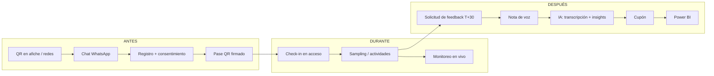

# 01 · Visión y Alcance

## 1. Problema

Coca-Cola ejecuta eventos experienciales (festivales, lanzamientos, activaciones, pop-ups) cuyo impacto es difícil de medir:

| Problema | Consecuencia |
|----------|--------------|
| Datos fragmentados (planillas, formularios en papel) | No hay métricas en tiempo real ni consolidadas entre eventos |
| Apps nativas para un evento de pocas horas | Rebote > 80 %, baja adopción |
| Sin trazabilidad dentro del recinto | *Sampling abuse* (una persona retira múltiples muestras) y no se sabe qué actividad funcionó |
| Encuestas post-evento cerradas | Tasa de respuesta < 3 % y sin emoción genuina |

## 2. Visión

> Convertir cada contacto físico de un evento de Coca-Cola en un dato estructurado y accionable, **sin pedirle al consumidor que descargue nada**.

El participante vive todo el viaje por **WhatsApp**; el staff opera con una **PWA** en su teléfono; marketing ve los resultados **en vivo** en un dashboard y en **Power BI**.

## 3. Objetivos de negocio y KPIs

| Objetivo | KPI | Meta MVP |
|----------|-----|----------|
| Reducir fricción de registro | % de conversaciones iniciadas que terminan en registro | ≥ 60 % |
| Medir asistencia real | Tasa de asistencia (asistidos / registrados) | Medida en 100 % de eventos |
| Eliminar abuso de sampling | Muestras duplicadas entregadas | 0 (bloqueo en servidor) |
| Velocidad de ingreso | Tiempo de respuesta de escaneo (p95) | < 1 s online |
| Feedback cualitativo | Tasa de respuesta de notas de voz (feedback / asistidos) | ≥ 15 % |
| Intención de compra | % de feedback con `purchaseIntent = true` | Medido y segmentado por producto |
| Fidelización | Tasa de recurrencia entre eventos | Medido |

Definiciones exactas de cada métrica: [10-analitica-power-bi.md](./10-analitica-power-bi.md).

## 4. Actores

| Actor | Canal | Autenticación | Descripción |
|-------|-------|---------------|-------------|
| **Participante / Consumidor** | WhatsApp | Su número de teléfono (identidad implícita) | Se registra, recibe su QR, asiste, envía feedback por voz, recibe cupón |
| **Staff / Promotor** | PWA móvil (React) | Código de evento + PIN → JWT acotado al evento | Escanea QR para check-in y entrega de muestras |
| **Administrador de Marca / Operaciones** | Admin Dashboard (React) | Email + contraseña → JWT | Configura eventos, actividades, productos, cupones; monitorea en vivo |
| **Analista BI** | Power BI | Usuario de solo lectura en PostgreSQL | Consume vistas SQL |
| **Sistemas externos** | — | Firma de webhook / API keys | Meta WhatsApp Cloud API, OpenAI, Object Storage |

## 5. Ciclo de vida que cubre el sistema

## 6. Alcance

### 6.1 Dentro del MVP
1. Gestión de eventos, actividades, catálogo de productos y campañas de cupón (Admin).
2. Onboarding conversacional por WhatsApp con consentimiento y emisión de QR.
3. PWA de staff: check-in y sampling con semáforo Verde / Amarillo / Rojo y control antifraude.
4. Modo offline de **check-in** con sincronización posterior (ver [ADR-006](./13-decisiones-de-arquitectura.md#adr-006)).
5. Solicitud automática de feedback, pipeline Whisper + GPT-4o-mini, emisión de cupón.
6. Dashboard en vivo por evento (SSE) y vistas SQL para Power BI.
7. Derechos del titular básicos: cancelar inscripción y solicitar borrado de datos por WhatsApp.

### 6.2 Fuera del MVP (backlog futuro)
- Canje de cupones en retail/e-commerce con integración a POS (en MVP el cupón es un código informativo).
- Multi-idioma del bot (MVP: español).
- Multi-tenant por país/embotelladora.
- Sampling offline (MVP: sampling requiere conexión).
- App nativa, gamificación, ranking de participantes.
- Integración con CRM corporativo / CDP.

## 7. Supuestos y restricciones

- Se dispone de un número de **WhatsApp Business** verificado y plantillas aprobadas por Meta para mensajes fuera de la ventana de 24 h.
- Los recintos pueden tener conectividad inestable → el check-in debe tolerar desconexión.
- Normativa de datos personales aplicable (ej. Ley 19.628 / Ley 21.719 en Chile, GDPR si aplica). El consentimiento explícito es obligatorio antes de guardar datos.
- Política de marketing responsable de Coca-Cola: **no se hace marketing dirigido a menores** (ver `BR-REG-04`).
