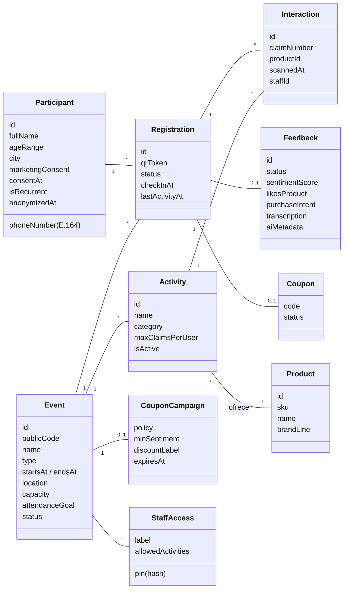
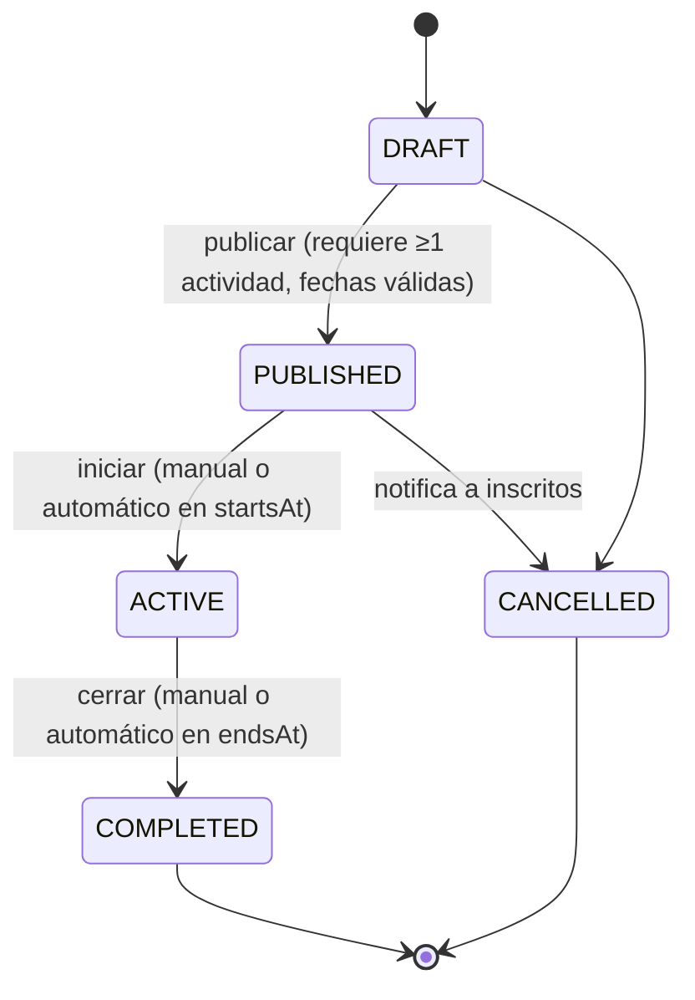
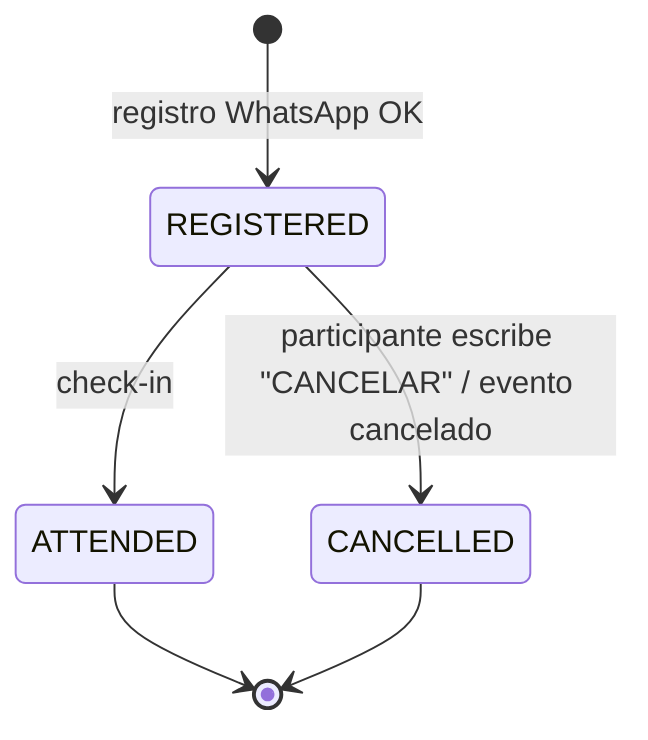
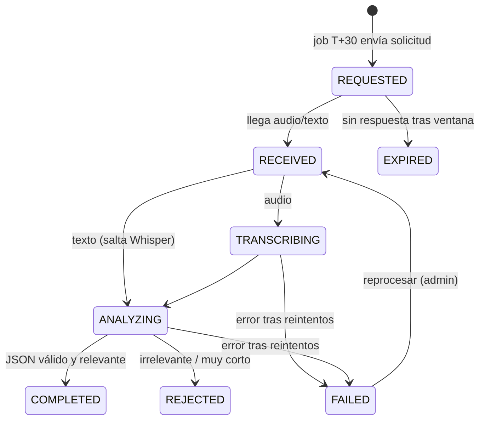

# 02 · Lógica de Negocio

Este documento define **qué** debe hacer el sistema, independiente de la tecnología. Cada regla tiene un ID estable (`BR-<área>-<n>`) que debe referenciarse en código y tests.

---

## 1. Modelo de dominio

### Agregados (límites de consistencia)
| Agregado | Raíz | Invariantes que protege |
|----------|------|-------------------------|
| **Event** | `Event` | Transiciones de estado, fechas válidas, configuración de actividades |
| **Registration** | `Registration` | Un QR por persona/evento, check-in único, límite de canjes por actividad (`Interaction` vive dentro del agregado) |
| **Participant** | `Participant` | Consentimiento, anonimización, recurrencia |
| **Feedback** | `Feedback` | Un feedback por inscripción, máquina de estados del pipeline |
| **Coupon** | `Coupon` | Un cupón por inscripción, emisión según política |

---

## 2. Máquinas de estado

### 2.1 Evento (`EventStatus`)

| Estado | Inscripción WhatsApp | Escaneo (check-in/sampling) | Feedback | Edición por admin |
|--------|:-------------------:|:---------------------------:|:--------:|-------------------|
| `DRAFT` | ❌ | ❌ | ❌ | Total |
| `PUBLISHED` | ✅ | ❌ | ❌ | Total excepto `publicCode` |
| `ACTIVE` | ✅ (si hay cupo) | ✅ | ✅ (asistidos) | Solo actividades/productos/staff |
| `COMPLETED` | ❌ | ❌ | ✅ hasta `endsAt + 48h` | Solo lectura |
| `CANCELLED` | ❌ | ❌ | ❌ | Solo lectura |

### 2.2 Inscripción (`RegistrationStatus`)

### 2.3 Feedback (`FeedbackStatus`)

### 2.4 Cupón (`CouponStatus`)
`ISSUED` → `REDEEMED` (futuro, integración retail) · `ISSUED` → `EXPIRED` (job diario tras `expiresAt`).

### 2.5 Conversación WhatsApp (`ConversationStep`)
`IDLE` → `ASK_NAME` → `ASK_AGE` → `ASK_CITY` → `ASK_CONSENT` → `IDLE` (registrado) · `IDLE` → `AWAITING_FEEDBACK` → `IDLE`. Detalle en [08-whatsapp-e-ia.md](./08-whatsapp-e-ia.md).

---

## 3. Reglas de negocio

### 3.1 Eventos (`BR-EVT`)
| ID | Regla |
|----|-------|
| BR-EVT-01 | `endsAt` debe ser posterior a `startsAt`. |
| BR-EVT-02 | `publicCode` es único, alfanumérico en mayúsculas, 4–12 caracteres (ej. `LOLLA26`). Identifica el evento en el mensaje inicial de WhatsApp (`wa.me/<num>?text=Hola%20CocaCola%20%23LOLLA26`). |
| BR-EVT-03 | Para publicar se requiere al menos una actividad activa y `capacity > 0`. |
| BR-EVT-04 | Un job pasa automáticamente `PUBLISHED → ACTIVE` en `startsAt` y `ACTIVE → COMPLETED` en `endsAt`. El admin puede adelantarlo manualmente. |
| BR-EVT-05 | Al cancelar un evento `PUBLISHED`, todas las inscripciones `REGISTERED` pasan a `CANCELLED` y se notifica por WhatsApp (plantilla). |
| BR-EVT-06 | `capacity` (aforo máximo de inscripciones) es distinto de `attendanceGoal` (meta de asistencia para KPI). |
| BR-EVT-07 | Overbooking: se aceptan inscripciones mientras `inscripciones vigentes < capacity × overbookingFactor` (por defecto `1.0`, configurable por evento, máx `1.5`). |

### 3.2 Inscripción / Onboarding (`BR-REG`)
| ID | Regla |
|----|-------|
| BR-REG-01 | El participante se identifica por su número de teléfono en formato **E.164**. Un número = un participante. |
| BR-REG-02 | Datos obligatorios: nombre completo (2–150 caracteres), rango de edad (`UNDER_18`, `18_24`, `25_34`, `35_44`, `45_PLUS`), ciudad/comuna. |
| BR-REG-03 | **Sin consentimiento no hay registro.** El consentimiento de tratamiento de datos es obligatorio; el de marketing es opcional y separado. Se guarda `consentAt` y `consentVersion`. Antes del consentimiento los datos se mantienen solo en la sesión conversacional (TTL 24 h) y no en `participants`. |
| BR-REG-04 | **Menores de edad:** si el rango es `UNDER_18`, el registro se rechaza con un mensaje amable (política por defecto). `❓ PENDIENTE` confirmar si algún tipo de evento permite menores (sin marketing ni cupones). |
| BR-REG-05 | Un participante solo puede tener **una inscripción por evento** (`UNIQUE(participantId, eventId)`). Si escribe de nuevo el código del evento, se le reenvía su QR existente. |
| BR-REG-06 | Si el participante ya existe, se actualizan sus datos si los cambia, sin volver a preguntar todo (el bot ofrece "¿Sigues siendo X de Y?"). |
| BR-REG-07 | **Recurrencia:** `isRecurrent = true` si el participante tiene al menos una inscripción `ATTENDED` en **otro** evento. Se recalcula al hacer check-in. (Corrige la idea original, donde bastaba con que el teléfono existiera). |
| BR-REG-08 | Solo se aceptan inscripciones con el evento en `PUBLISHED` o `ACTIVE` y con cupo (BR-EVT-07). Si no hay cupo → mensaje de "aforo completo". |
| BR-REG-09 | Cada inscripción genera un **token QR firmado** (HMAC-SHA256, ver [09](./09-seguridad-y-privacidad.md#3-tokens-qr)). El QR se envía como imagen por WhatsApp. |
| BR-REG-10 | El participante puede cancelar escribiendo `CANCELAR` mientras su inscripción esté `REGISTERED` y el evento no esté `COMPLETED`. Libera cupo. |
| BR-REG-11 | El participante puede escribir `BORRAR MIS DATOS` → se anonimiza (ver BR-PRV-02). |

### 3.3 Check-in (`BR-CHK`)
| ID | Regla | Resultado UI |
|----|-------|--------------|
| BR-CHK-01 | El token QR debe tener firma válida; si no → `QR_INVALID`. | 🔴 Rojo |
| BR-CHK-02 | El token debe pertenecer al evento del staff (JWT); si no → `QR_WRONG_EVENT`. | 🔴 Rojo |
| BR-CHK-03 | El evento debe estar `ACTIVE`; si no → `EVENT_NOT_ACTIVE`. | 🔴 Rojo |
| BR-CHK-04 | Inscripción `CANCELLED` → `REGISTRATION_CANCELLED`. | 🔴 Rojo |
| BR-CHK-05 | Inscripción ya `ATTENDED` → `ALREADY_CHECKED_IN` con hora del ingreso. **No es error de fraude**, es aviso. | 🟡 Amarillo |
| BR-CHK-06 | Caso válido: `REGISTERED → ATTENDED`, se guarda `checkInAt`, `checkInStaffId`, se recalcula recurrencia → `CHECK_IN_SUCCESS` con nombre y badge "recurrente". | 🟢 Verde |
| BR-CHK-07 | El check-in es **idempotente** por `clientScanId` (UUID generado por la PWA): un reintento con el mismo ID devuelve la misma respuesta original. | — |
| BR-CHK-08 | Check-in offline: la PWA valida contra un manifiesto local y encola; al sincronizar, el servidor aplica la regla "**el primer `scannedAt` gana**" y reporta conflictos. | 🟢/🟡 |

### 3.4 Sampling / Actividades (`BR-SAM`)
| ID | Regla | Resultado UI |
|----|-------|--------------|
| BR-SAM-01 | Aplican BR-CHK-01..04. | 🔴 |
| BR-SAM-02 | La inscripción debe estar `ATTENDED` (hizo check-in); si no → `NOT_CHECKED_IN`. | 🟡 Amarillo (enviar a acceso) |
| BR-SAM-03 | La actividad debe pertenecer al evento, estar activa y estar habilitada para el `StaffAccess` del promotor → si no `ACTIVITY_NOT_ALLOWED`. | 🔴 |
| BR-SAM-04 | El producto debe estar en el catálogo de la actividad → si no `PRODUCT_NOT_IN_ACTIVITY`. Actividades sin productos (ej. Photocall) no requieren producto. | 🔴 |
| BR-SAM-05 | **Antifraude:** el número de interacciones del participante en la actividad debe ser `< maxClaimsPerUser`; si no → `BENEFIT_ALREADY_REDEEMED` con la hora del último canje. | 🔴 Rojo |
| BR-SAM-06 | La regla BR-SAM-05 se garantiza **en base de datos**: cada interacción tiene `claimNumber ∈ [1..max]` con `UNIQUE(registrationId, activityId, claimNumber)`. Dos escaneos simultáneos no pueden obtener el mismo `claimNumber`. | — |
| BR-SAM-07 | Caso válido → se crea `Interaction`, se actualiza `Registration.lastActivityAt` → `SAMPLING_CLAIMED`, mostrando "canje N de M". | 🟢 Verde |
| BR-SAM-08 | Idempotente por `clientScanId` (igual que BR-CHK-07). | — |
| BR-SAM-09 | Sampling **requiere conexión** en el MVP (ADR-006). Sin red la PWA muestra "Sin conexión: no entregar". | ⚪ Gris |

### 3.5 Feedback e IA (`BR-FBK`)
| ID | Regla |
|----|-------|
| BR-FBK-01 | Solo inscripciones `ATTENDED` reciben solicitud de feedback. Una sola solicitud por inscripción. |
| BR-FBK-02 | **Disparo:** un job cada 5 min solicita feedback a quienes cumplan `lastActivityAt + 30 min ≤ ahora` **o** el evento esté `COMPLETED`, lo que ocurra primero. Ventana horaria permitida 09:00–22:00 hora local del evento; fuera de ella se pospone. |
| BR-FBK-03 | Si han pasado > 24 h desde el último mensaje del participante, se debe usar **plantilla aprobada** de WhatsApp (regla de Meta). |
| BR-FBK-04 | Se acepta **nota de voz** (preferido) o **texto**. Audio: duración 3–90 s, máx 16 MB, tipos `audio/ogg`, `audio/mpeg`, `audio/mp4`, `audio/amr`. Fuera de rango → el bot pide reenviar (máx 2 intentos). |
| BR-FBK-05 | La ventana de respuesta cierra en `endsAt + 48 h`; luego `REQUESTED → EXPIRED`. |
| BR-FBK-06 | Un feedback por inscripción. Mensajes posteriores reciben "¡Ya recibimos tu opinión, gracias!". |
| BR-FBK-07 | El análisis IA devuelve: `sentimentScore` (1–5), `likesProduct`, `purchaseIntent`, `keyTopics[]`, `flavorAttributes[]`, `productsMentioned[]`, `executiveQuote`, `isRelevant`, `language`. Se valida contra JSON Schema; si no valida → reintento. |
| BR-FBK-08 | `isRelevant = false` o transcripción < 5 palabras → `REJECTED`, sin cupón; el bot pide amablemente un audio sobre la experiencia (1 intento extra). |
| BR-FBK-09 | Reintentos del pipeline: 3 con backoff exponencial (30 s, 2 min, 10 min). Luego `FAILED` y alerta en dashboard; el admin puede reprocesar. |
| BR-FBK-10 | Feedback con `sentimentScore ≤ 2` genera **alerta de detractor** visible en el dashboard en vivo. |

### 3.6 Cupones (`BR-CPN`)
| ID | Regla |
|----|-------|
| BR-CPN-01 | Cada evento puede tener una `CouponCampaign` (texto de descuento, prefijo, vigencia, política). Sin campaña → no se emiten cupones. |
| BR-CPN-02 | Política configurable: `ANY_VALID_FEEDBACK` (cupón por todo feedback `COMPLETED`) o `MIN_SENTIMENT` (solo si `sentimentScore ≥ minSentiment`, por defecto 3, como en la idea original). **Por defecto: `MIN_SENTIMENT = 3`.** ⚠️ Ver pregunta abierta Q-02 sobre sesgo. |
| BR-CPN-03 | Máximo **un cupón por inscripción**. |
| BR-CPN-04 | Código: `<PREFIJO>-<8 caracteres base32 sin ambigüedades>` (ej. `ZERO26-K7M2QX9P`), único global. |
| BR-CPN-05 | Los cupones vencen en `expiresAt` de la campaña (job diario marca `EXPIRED`). |
| BR-CPN-06 | Si no se emite cupón (política no cumplida), el bot agradece igual, sin mencionar el cupón. |

### 3.7 Staff y acceso (`BR-STF`)
| ID | Regla |
|----|-------|
| BR-STF-01 | El admin genera accesos de staff por evento: etiqueta (ej. "Stand Zero 1"), PIN de 6 dígitos (se muestra una sola vez, se guarda hasheado) y actividades permitidas (o "solo check-in"). |
| BR-STF-02 | Login staff: `publicCode` + PIN → JWT con `eventId`, `staffAccessId`, `allowedActivityIds`, vigencia hasta `endsAt + 2 h`. |
| BR-STF-03 | 5 intentos fallidos de PIN por IP/evento → bloqueo 15 min. |
| BR-STF-04 | El admin puede revocar un acceso; los JWT asociados dejan de ser válidos (se verifica `revokedAt` en cada request). |
| BR-STF-05 | Toda acción de escaneo registra `staffAccessId` para auditoría. |

### 3.8 Privacidad (`BR-PRV`)
| ID | Regla |
|----|-------|
| BR-PRV-01 | Audios crudos se eliminan del storage **30 días** después de `endsAt`; se conserva transcripción y análisis. |
| BR-PRV-02 | Anonimización: nombre → `"Anonimizado"`, teléfono → hash irreversible, ciudad se mantiene (dato agregado), transcripciones y audios se borran, métricas agregadas se conservan. |
| BR-PRV-03 | Mensajes de marketing proactivos solo a participantes con `marketingConsent = true`. La solicitud de feedback y el cupón son parte del servicio solicitado, no marketing. |
| BR-PRV-04 | Las vistas para Power BI **no exponen** teléfono ni nombre. |

---

## 4. Políticas configurables (por evento)

| Parámetro | Tipo | Por defecto | Regla |
|-----------|------|-------------|-------|
| `overbookingFactor` | decimal | `1.0` | BR-EVT-07 |
| `feedbackDelayMinutes` | int | `30` | BR-FBK-02 |
| `feedbackWindowHours` | int | `48` | BR-FBK-05 |
| `quietHoursStart/End` | hora | `22:00` / `09:00` | BR-FBK-02 |
| `couponPolicy` | enum | `MIN_SENTIMENT` | BR-CPN-02 |
| `couponMinSentiment` | int 1–5 | `3` | BR-CPN-02 |
| `allowMinors` | bool | `false` | BR-REG-04 |
| `audioRetentionDays` | int | `30` | BR-PRV-01 |

Globales (variables de entorno): ver [12-guia-de-desarrollo.md](./12-guia-de-desarrollo.md#4-variables-de-entorno).

---

## 5. Casos de uso (capa de aplicación)

Cada caso de uso es una clase en `application/use-cases` del módulo correspondiente (ver [04](./04-arquitectura-backend-nestjs.md)).

| Caso de uso | Actor | Módulo | Reglas |
|-------------|-------|--------|--------|
| `CreateEvent`, `UpdateEvent` | Admin | events | BR-EVT-01,02,06 |
| `PublishEvent`, `StartEvent`, `CompleteEvent`, `CancelEvent` | Admin / Job | events | BR-EVT-03,04,05 |
| `ManageActivities`, `ManageProducts` | Admin | events / catalog | BR-SAM-03,04 |
| `CreateStaffAccess`, `RevokeStaffAccess` | Admin | auth | BR-STF-01,04 |
| `StaffLogin`, `AdminLogin` | Staff / Admin | auth | BR-STF-02,03 |
| `HandleInboundWhatsappMessage` | Sistema | conversations | Orquesta los siguientes |
| `RegisterParticipant` | Participante | registrations | BR-REG-01..09 |
| `CancelRegistration` | Participante | registrations | BR-REG-10 |
| `AnonymizeParticipant` | Participante / Admin | participants | BR-PRV-02 |
| `CheckInAttendee` | Staff | scanning | BR-CHK-01..07 |
| `SyncOfflineCheckIns` | Staff | scanning | BR-CHK-08 |
| `ClaimActivityBenefit` | Staff | scanning | BR-SAM-01..08 |
| `RequestFeedback` | Job | feedback | BR-FBK-01..03 |
| `ReceiveFeedback` | Sistema | feedback | BR-FBK-04,05,06 |
| `ProcessFeedback` (worker) | Sistema | feedback | BR-FBK-07,08,09,10 |
| `IssueCoupon` | Sistema | coupons | BR-CPN-01..06 |
| `GetEventLiveMetrics`, `StreamEventLive` | Admin | analytics | — |
| `PurgeExpiredAudios`, `ExpireCoupons`, `ExpireFeedbackRequests` | Job | feedback / coupons | BR-PRV-01, BR-CPN-05, BR-FBK-05 |

---

## 6. Eventos de dominio

Emitidos tras confirmar la transacción (`@nestjs/event-emitter`); los consumen analytics (SSE), notificaciones y auditoría.

| Evento | Payload | Consumidores |
|--------|---------|--------------|
| `registration.created` | registrationId, eventId, participantId | analytics, conversations (envía QR) |
| `registration.cancelled` | registrationId, eventId | analytics |
| `attendee.checked_in` | registrationId, eventId, isRecurrent, at | analytics (SSE), audit |
| `benefit.claimed` | registrationId, activityId, productId, at | analytics (SSE), audit |
| `benefit.rejected` | qr, activityId, reasonCode | analytics (alertas de fraude), audit |
| `feedback.received` | feedbackId | feedback (encola pipeline) |
| `feedback.completed` | feedbackId, sentimentScore, purchaseIntent | coupons, analytics (SSE) |
| `feedback.detractor_detected` | feedbackId, eventId | analytics (alerta) |
| `coupon.issued` | couponId, registrationId | conversations (envía cupón) |
| `event.status_changed` | eventId, from, to | conversations, analytics |

---

## 7. Mensajes del bot (tono de marca)

Tono: cálido, enérgico, optimista, breve; tuteo; emojis moderados. Textos centralizados en `conversations/domain/messages.es.ts` (no hardcodear en lógica). Mensajes clave:

| Clave | Texto (ejemplo) |
|-------|-----------------|
| `WELCOME` | ¡Hola! 👋 Qué bueno tenerte en **{eventName}**. Te inscribo en menos de un minuto. ¿Cuál es tu nombre completo? |
| `ASK_AGE` | ¡Genial, {firstName}! ¿En qué rango de edad estás? (botones) |
| `ASK_CITY` | ¿De qué ciudad o comuna nos escribes? |
| `ASK_CONSENT` | Para inscribirte necesitamos tu autorización para tratar tus datos según nuestra política: {url}. (botones: *Acepto* / *No acepto*) — y aparte: ¿Quieres recibir novedades y promociones? (*Sí* / *No*) |
| `REGISTERED` | ¡Listo, {firstName}! 🎉 Este es tu pase para {eventName}. Muéstralo en el acceso. 📍 {location} · 🗓 {date} |
| `MINOR_REJECTED` | ¡Gracias por tu interés! Este evento es solo para mayores de 18 años. 💛 |
| `FULL_CAPACITY` | ¡Uf! El aforo de {eventName} ya está completo. Te avisaremos de próximos eventos. |
| `FEEDBACK_REQUEST` | ¡Hola {firstName}! 🎉 Gracias por acompañarnos en {eventName}. Mándanos una nota de voz (15–30 seg) contándonos qué te pareció y qué fue lo que más disfrutaste. |
| `FEEDBACK_THANKS_COUPON` | ¡Nos alegra un montón! 🎁 Aquí tienes tu cupón: **{code}** — {discountLabel}. Válido hasta {expiresAt}. |
| `FEEDBACK_THANKS` | ¡Gracias por tu opinión! Nos ayuda a mejorar cada evento. 🙌 |
| `HELP` | Puedes escribir: **MI QR**, **CANCELAR**, **BORRAR MIS DATOS** o **AYUDA**. |

---

## 8. Escenarios de borde (y cómo se resuelven)

| Escenario | Resolución |
|-----------|-----------|
| Participante muestra captura de pantalla del QR de otro | El check-in muestra nombre; el staff puede pedir verificación visual. Una vez usado el QR, segundo intento → 🟡. |
| Dos promotores escanean el mismo QR en el mismo stand a la vez | `claimNumber` + UNIQUE → uno gana (🟢), el otro recibe `BENEFIT_ALREADY_REDEEMED` (🔴). |
| La PWA pierde la respuesta y reintenta | `clientScanId` → misma respuesta, sin duplicar. |
| Meta reenvía el mismo webhook | Dedupe por `waMessageId` único en `whatsapp_messages`. |
| El participante manda audio antes de que se le solicite | Si está `ATTENDED` y el evento `ACTIVE`/`COMPLETED`, se acepta como feedback anticipado; si no, se responde con ayuda. |
| El participante está inscrito en 2 eventos activos y manda audio | Se asocia a la inscripción `ATTENDED` con feedback `REQUESTED` más reciente. |
| OpenAI caído | Cola con reintentos (BR-FBK-09); el bot responde "¡Recibido! Te escribimos en un rato". |
| Evento cambia de fecha | Notificación por plantilla a inscritos (admin la dispara). |

---

## 9. Preguntas abiertas

| ID | Pregunta | Default mientras tanto |
|----|----------|------------------------|
| Q-01 | ¿Hay eventos que admitan menores (familiares)? ¿Con qué restricciones? | Se rechazan (BR-REG-04). |
| Q-02 | Condicionar el cupón al sentimiento **sesga** el feedback (y los participantes lo aprenden). ¿Se mantiene `MIN_SENTIMENT` o se pasa a `ANY_VALID_FEEDBACK`? | `MIN_SENTIMENT = 3` (idea original). **Recomendación técnica: `ANY_VALID_FEEDBACK`.** |
| Q-03 | ¿El cupón se canjea en algún sistema (POS, e-commerce) que debamos integrar? | Solo código informativo. |
| Q-04 | ¿Proveedor WhatsApp definitivo: Meta Cloud API directa o Twilio? | Meta Cloud API, detrás de un puerto (`WhatsappGateway`). |
| Q-05 | ¿País/zona horaria y normativa aplicable para el piloto? | Chile, `America/Santiago`. |
| Q-06 | ¿Se requiere sampling offline en recintos sin señal? | No (ADR-006). |
