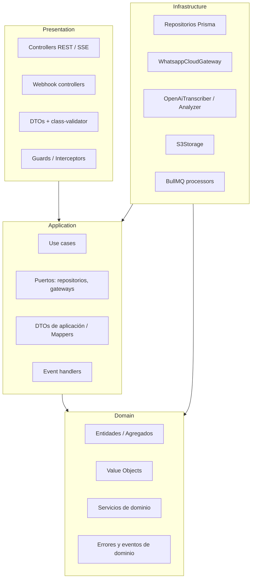
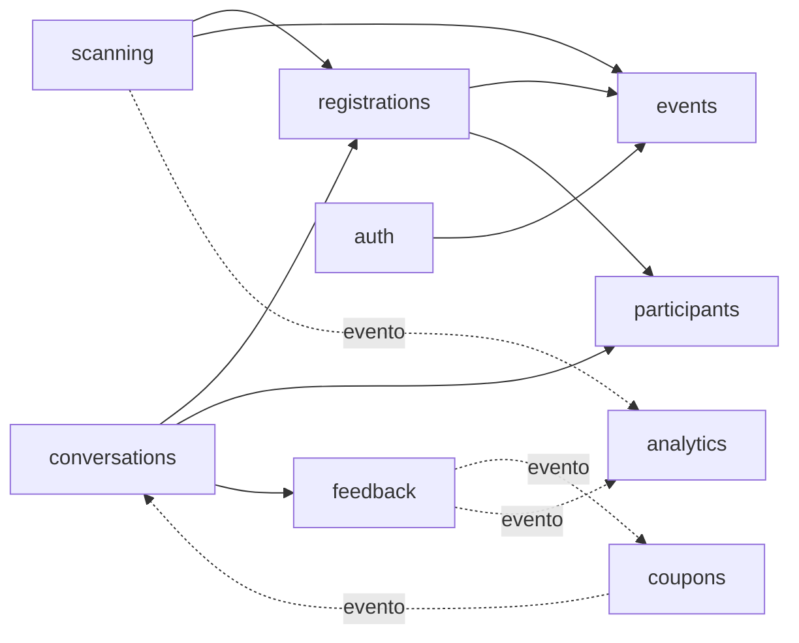

# 04 · Arquitectura Backend (NestJS)

## 1. Principios

1. **Arquitectura por capas (Clean / Hexagonal) dentro de cada módulo de negocio.** El dominio no conoce NestJS, Prisma, HTTP, WhatsApp ni OpenAI.
2. **Regla de dependencia:** las dependencias apuntan siempre hacia adentro: `presentation → application → domain` e `infrastructure → application/domain`. Nunca al revés.
3. **Monolito modular:** un solo despliegue (`apps/api`) + un proceso worker (`apps/api` en modo worker) que comparten código. Cada módulo es candidato a extraerse en el futuro.
4. **Puertos y adaptadores:** toda dependencia externa (DB, WhatsApp, IA, storage, reloj, colas) se accede vía una interfaz (puerto) definida en `application`, implementada en `infrastructure`.
5. **Errores de dominio tipados**, traducidos a HTTP en un único filtro global.

## 2. Capas



| Capa | Responsabilidad | Puede importar | Prohibido |
|------|-----------------|----------------|-----------|
| **Domain** | Reglas de negocio puras (BR-xxx), entidades, VOs, errores, eventos | Solo TypeScript y `shared/domain` | `@nestjs/*`, `@prisma/client`, librerías de IO |
| **Application** | Orquesta casos de uso: carga agregados vía puertos, invoca dominio, persiste, publica eventos. Define transacciones. | Domain, `@nestjs/common` (solo `Injectable`, `Inject`) | Prisma, HTTP, SDKs externos |
| **Infrastructure** | Implementa puertos: Prisma, Meta API, OpenAI, S3, BullMQ, cron | Application, Domain, SDKs | Lógica de negocio |
| **Presentation** | HTTP/SSE/webhooks: valida input (DTO), autoriza (guards), llama al caso de uso, mapea respuesta | Application | Acceso directo a repositorios o Prisma |

## 3. Módulos

| Módulo | Responsabilidad | Agregados / Entidades | Casos de uso principales |
|--------|-----------------|-----------------------|--------------------------|
| `auth` | Login admin y staff, JWT, guards, accesos de staff | `AdminUser`, `StaffAccess` | `AdminLogin`, `StaffLogin`, `CreateStaffAccess`, `RevokeStaffAccess` |
| `events` | Eventos, actividades, políticas, ciclo de vida | `Event`, `Activity` | `CreateEvent`, `PublishEvent`, `CancelEvent`, `ManageActivities` |
| `catalog` | Productos | `Product` | `CreateProduct`, `ListProducts` |
| `participants` | Participantes, consentimiento, anonimización | `Participant` | `UpsertParticipant`, `AnonymizeParticipant` |
| `registrations` | Inscripciones y tokens QR | `Registration` | `RegisterParticipant`, `CancelRegistration`, `GetRegistrationQr` |
| `scanning` | Check-in, sampling, sync offline, manifiesto | `Registration` (+ `Interaction`) | `CheckInAttendee`, `ClaimActivityBenefit`, `SyncOfflineCheckIns`, `GetOfflineManifest` |
| `conversations` | Bot WhatsApp: sesión, máquina de estados, comandos, mensajes | `ConversationSession` | `HandleInboundWhatsappMessage`, `SendQrPass` |
| `feedback` | Solicitud, recepción y pipeline IA | `Feedback` | `RequestFeedback`, `ReceiveFeedback`, `ProcessFeedback`, `ReprocessFeedback` |
| `coupons` | Campañas y emisión | `CouponCampaign`, `Coupon` | `IssueCoupon`, `ExpireCoupons` |
| `analytics` | Métricas en vivo, SSE, consultas de lectura | (lecturas) | `GetEventMetrics`, `StreamEventLive`, `CompareEvents` |
| `audit` | Registro de auditoría | `AuditLog` | handler de eventos de dominio |
| `shared` | Kernel compartido: config, Prisma, colas, logger, reloj, errores base, Result | — | — |

### Dependencias permitidas entre módulos
- Un módulo usa a otro **solo a través de su `application` (casos de uso o puertos exportados)** o reaccionando a **eventos de dominio**. Nunca importa repositorios o entidades internas de otro módulo.
- `scanning` y `registrations` comparten el agregado `Registration`: `registrations` es dueño del agregado y exporta el puerto `RegistrationRepository`; `scanning` lo consume.
- `conversations` es un orquestador: llama a casos de uso de `registrations`, `participants` y `feedback`.



## 4. Estructura de carpetas

```text
apps/api/
├── prisma/
│   ├── schema.prisma
│   ├── migrations/
│   ├── sql/                       # vistas Power BI (migración SQL cruda)
│   └── seed.ts
├── src/
│   ├── main.ts                    # bootstrap HTTP
│   ├── worker.ts                  # bootstrap worker (BullMQ + cron), sin HTTP
│   ├── app.module.ts
│   ├── shared/
│   │   ├── config/                # @nestjs/config + validación zod del .env
│   │   ├── domain/                # AggregateRoot, DomainError, DomainEvent, Result, Clock
│   │   ├── infrastructure/
│   │   │   ├── prisma/            # PrismaService, TransactionManager (CLS)
│   │   │   ├── queue/             # BullMQ module y nombres de colas
│   │   │   ├── storage/           # ObjectStorage port + S3 adapter
│   │   │   └── logger/            # pino
│   │   └── presentation/
│   │       ├── filters/           # DomainExceptionFilter → envelope de error
│   │       ├── interceptors/      # ResponseEnvelope, Idempotency, RequestId
│   │       ├── guards/            # JwtAuthGuard, RolesGuard, StaffEventGuard
│   │       └── decorators/        # @CurrentStaff(), @Roles(), @Public()
│   └── modules/
│       └── scanning/              # ejemplo completo de un módulo
│           ├── domain/
│           │   ├── scan-result.ts
│           │   └── errors/
│           │       ├── already-checked-in.error.ts
│           │       └── benefit-already-redeemed.error.ts
│           ├── application/
│           │   ├── ports/
│           │   │   └── scan-idempotency.store.ts
│           │   ├── use-cases/
│           │   │   ├── check-in-attendee.use-case.ts
│           │   │   ├── check-in-attendee.use-case.spec.ts
│           │   │   ├── claim-activity-benefit.use-case.ts
│           │   │   └── sync-offline-check-ins.use-case.ts
│           │   └── dto/
│           ├── infrastructure/
│           │   └── redis-scan-idempotency.store.ts
│           ├── presentation/
│           │   ├── scan.controller.ts
│           │   └── dto/
│           │       ├── check-in.request.ts
│           │       └── sampling.request.ts
│           └── scanning.module.ts
└── test/
    ├── e2e/                       # supertest + Testcontainers (Postgres, Redis)
    └── factories/
```

**Convención de nombres de archivo:** `kebab-case.<tipo>.ts` → `*.use-case.ts`, `*.entity.ts`, `*.vo.ts`, `*.error.ts`, `*.repository.ts` (puerto), `prisma-*.repository.ts` (adaptador), `*.controller.ts`, `*.request.ts` / `*.response.ts` (DTO HTTP), `*.processor.ts` (BullMQ), `*.job.ts` (cron), `*.spec.ts` (unit), `*.e2e-spec.ts`.

## 5. Ejemplo de referencia (flujo vertical: Sampling)

### 5.1 Domain — agregado `Registration`
```ts
// modules/registrations/domain/registration.entity.ts
export class Registration extends AggregateRoot {
  private constructor(private props: RegistrationProps) { super(); }

  static restore(props: RegistrationProps) { return new Registration(props); }

  checkIn(staffAccessId: string, at: Date): void {
    if (this.props.status === RegistrationStatus.CANCELLED) throw new RegistrationCancelledError();   // BR-CHK-04
    if (this.props.status === RegistrationStatus.ATTENDED)
      throw new AlreadyCheckedInError(this.props.checkInAt!);                                          // BR-CHK-05
    this.props.status = RegistrationStatus.ATTENDED;
    this.props.checkInAt = at;
    this.props.checkInStaffAccessId = staffAccessId;
    this.props.lastActivityAt = at;
    this.addEvent(new AttendeeCheckedIn(this.id, this.props.eventId, at));
  }

  claimBenefit(activity: ActivityPolicy, productId: string | null, staffAccessId: string, at: Date): Interaction {
    if (this.props.status !== RegistrationStatus.ATTENDED) throw new NotCheckedInError();              // BR-SAM-02
    activity.assertProductAllowed(productId);                                                          // BR-SAM-04
    const claims = this.props.claimsByActivity[activity.id] ?? [];
    if (claims.length >= activity.maxClaimsPerUser)
      throw new BenefitAlreadyRedeemedError(claims.at(-1)!.scannedAt);                                 // BR-SAM-05
    const interaction = Interaction.create({
      registrationId: this.id, activityId: activity.id, productId, staffAccessId,
      claimNumber: claims.length + 1, scannedAt: at,                                                   // BR-SAM-06
    });
    this.props.lastActivityAt = at;
    this.addEvent(new BenefitClaimed(this.id, activity.id, productId, at));
    return interaction;
  }
}
```

### 5.2 Application — puerto y caso de uso
```ts
// modules/registrations/application/ports/registration.repository.ts
export const REGISTRATION_REPOSITORY = Symbol('REGISTRATION_REPOSITORY');
export interface RegistrationRepository {
  findByQrHash(qrHash: string, opts?: { lock?: boolean }): Promise<Registration | null>;
  save(registration: Registration): Promise<void>;
  addInteraction(interaction: Interaction): Promise<void>; // lanza ConcurrencyConflictError si choca el UNIQUE
}
```

```ts
// modules/scanning/application/use-cases/claim-activity-benefit.use-case.ts
@Injectable()
export class ClaimActivityBenefitUseCase {
  constructor(
    @Inject(REGISTRATION_REPOSITORY) private readonly registrations: RegistrationRepository,
    @Inject(ACTIVITY_QUERY) private readonly activities: ActivityQuery,
    @Inject(QR_TOKEN_SERVICE) private readonly qr: QrTokenService,
    @Inject(TRANSACTION_MANAGER) private readonly tx: TransactionManager,
    @Inject(EVENT_PUBLISHER) private readonly events: DomainEventPublisher,
    @Inject(CLOCK) private readonly clock: Clock,
  ) {}

  async execute(cmd: ClaimBenefitCommand): Promise<ClaimBenefitResult> {
    const qrHash = this.qr.verify(cmd.qrToken, cmd.staff.eventId);          // BR-CHK-01/02
    const activity = await this.activities.getPolicy(cmd.activityId, cmd.staff); // BR-SAM-03

    const result = await this.tx.run(async () => {
      const reg = await this.registrations.findByQrHash(qrHash, { lock: true });
      if (!reg) throw new QrInvalidError();
      const interaction = reg.claimBenefit(activity, cmd.productId, cmd.staff.staffAccessId, this.clock.now());
      await this.registrations.addInteraction(interaction);
      await this.registrations.save(reg);
      return { reg, interaction };
    });

    await this.events.publishAll(result.reg.pullEvents());                 // tras commit
    return ClaimBenefitResult.from(result.reg, result.interaction, activity);
  }
}
```

### 5.3 Infrastructure — adaptador Prisma
```ts
// modules/registrations/infrastructure/prisma-registration.repository.ts
@Injectable()
export class PrismaRegistrationRepository implements RegistrationRepository {
  constructor(private readonly prisma: PrismaTxClient) {}   // cliente transaccional vía CLS

  async findByQrHash(qrHash: string, opts?: { lock?: boolean }) {
    if (opts?.lock) {
      await this.prisma.$queryRaw`SELECT id FROM event_registrations WHERE qr_hash = ${qrHash} FOR UPDATE`;
    }
    const row = await this.prisma.registration.findUnique({
      where: { qrHash }, include: { interactions: true },
    });
    return row ? RegistrationMapper.toDomain(row) : null;
  }

  async addInteraction(i: Interaction) {
    try {
      await this.prisma.interaction.create({ data: InteractionMapper.toPersistence(i) });
    } catch (e) {
      if (isPrismaUniqueViolation(e)) throw new BenefitAlreadyRedeemedError(i.scannedAt); // BR-SAM-06
      throw e;
    }
  }
  // save(...)
}
```

### 5.4 Presentation — controller y DTO
```ts
// modules/scanning/presentation/dto/sampling.request.ts
export class SamplingRequest {
  @IsString() @Length(20, 200) qrToken!: string;
  @IsUUID() activityId!: string;
  @IsOptional() @IsUUID() productId?: string;
  @IsUUID() clientScanId!: string;
  @IsISO8601() scannedAt!: string;
}

// modules/scanning/presentation/scan.controller.ts
@Controller({ path: 'scan', version: '1' })
@UseGuards(JwtAuthGuard, RolesGuard)
@Roles(Role.STAFF)
export class ScanController {
  constructor(
    private readonly checkIn: CheckInAttendeeUseCase,
    private readonly claim: ClaimActivityBenefitUseCase,
  ) {}

  @Post('sampling')
  @HttpCode(201)
  @UseInterceptors(IdempotencyInterceptor)          // BR-SAM-08 (clientScanId)
  sampling(@Body() body: SamplingRequest, @CurrentStaff() staff: StaffPrincipal) {
    return this.claim.execute({ ...body, staff });
  }
}
```

### 5.5 Módulo — inyección de puertos
```ts
@Module({
  imports: [RegistrationsModule, EventsModule],
  controllers: [ScanController],
  providers: [
    CheckInAttendeeUseCase,
    ClaimActivityBenefitUseCase,
    SyncOfflineCheckInsUseCase,
    { provide: SCAN_IDEMPOTENCY_STORE, useClass: RedisScanIdempotencyStore },
  ],
})
export class ScanningModule {}
```

## 6. Manejo de errores

```ts
// shared/domain/domain-error.ts
export abstract class DomainError extends Error {
  abstract readonly code: ErrorCode;          // de @cocacola-ei/contracts
  readonly details?: Record<string, unknown>;
}
```
`DomainExceptionFilter` mapea `code → HTTP status` usando la tabla de [07-contratos-api.md §3](./07-contratos-api.md#3-catálogo-de-códigos), y produce el envelope estándar. Errores no controlados → `500 INTERNAL_ERROR` sin filtrar el stack (se loguea con `requestId`).

## 7. Transacciones y consistencia
- `TransactionManager.run(fn)` abre una transacción Prisma interactiva y la propaga vía **CLS** (`nestjs-cls` + `@nestjs-cls/transactional`) para que los repositorios la usen sin pasarla por parámetro.
- Nivel de aislamiento: `READ COMMITTED` + `SELECT … FOR UPDATE` sobre la inscripción en check-in/sampling + `UNIQUE` como red de seguridad final.
- **Eventos de dominio se publican después del commit.** Para efectos críticos (envío de QR, cupón) el handler encola un job en BullMQ (reintentable). Evolución futura: patrón *Outbox* si se requiere garantía exactly-once (ADR-008).

## 8. Procesamiento asíncrono (BullMQ + Redis)

| Cola | Productor | Job | Reintentos |
|------|-----------|-----|------------|
| `whatsapp-outbound` | conversations, coupons | Enviar texto / imagen QR / plantilla | 5, backoff exp. |
| `whatsapp-inbound` | webhook controller | Procesar mensaje entrante (responde 200 a Meta de inmediato) | 3 |
| `feedback-pipeline` | feedback | Descargar audio → storage → Whisper → GPT → persistir | 3 (30 s, 2 min, 10 min) |
| `qr-render` | registrations | Generar PNG del QR y subir a storage | 3 |

**Jobs programados** (`@nestjs/schedule`, solo en el proceso worker, con lock distribuido en Redis):

| Job | Frecuencia | Regla |
|-----|-----------|-------|
| `EventLifecycleJob` | cada 1 min | BR-EVT-04 |
| `FeedbackRequestJob` | cada 5 min | BR-FBK-02 |
| `ExpireFeedbackRequestsJob` | cada 1 h | BR-FBK-05 |
| `ExpireCouponsJob` | diario 03:00 | BR-CPN-05 |
| `PurgeAudiosJob` | diario 04:00 | BR-PRV-01 |
| `RefreshMaterializedViewsJob` | cada 5 min | [10](./10-analitica-power-bi.md) |

## 9. Tiempo real (Admin Dashboard)
- `GET /api/v1/events/:id/live` con **SSE** (`@Sse()`), autenticado (token por query `?access_token=` de corta vida, porque `EventSource` no envía headers).
- `analytics` escucha eventos de dominio y publica en **Redis Pub/Sub** (`event:<id>:live`) para que funcione con varias instancias del API.
- Mensajes: `snapshot` (al conectar) y `delta` (`checked_in`, `benefit_claimed`, `benefit_rejected`, `feedback_completed`, `detractor_alert`).

## 10. Transversales
- **Config:** `@nestjs/config` con esquema zod; la app no arranca si falta una variable.
- **Validación:** `ValidationPipe({ whitelist: true, forbidNonWhitelisted: true, transform: true })`.
- **Versionado:** URI `/api/v1`.
- **OpenAPI:** `@nestjs/swagger` en `/api/docs` (solo no-producción). Es el contrato vivo; [07](./07-contratos-api.md) es la referencia funcional.
- **Seguridad:** `helmet`, CORS restringido a los orígenes del frontend, `@nestjs/throttler` (límites en [09](./09-seguridad-y-privacidad.md)).
- **Logs:** `nestjs-pino`, JSON, `requestId` propagado; nunca loguear teléfonos completos, tokens QR ni transcripciones.
- **Health:** `@nestjs/terminus` en `/health` (Postgres, Redis).

## 11. Testing backend

| Nivel | Qué | Herramientas | Objetivo |
|-------|-----|--------------|----------|
| Unit — dominio | Entidades y reglas BR-xxx | Jest, sin mocks de framework | 100 % de reglas con test nombrado por ID |
| Unit — aplicación | Casos de uso con puertos falsos (in-memory) | Jest | Flujos felices y de error |
| Integración | Repositorios Prisma, constraints, concurrencia | Jest + Testcontainers (Postgres 16) | `UNIQUE`/`FOR UPDATE` probados con `Promise.all` |
| E2E | Endpoints HTTP + webhook simulado | supertest + Testcontainers + fakes de WhatsApp/OpenAI | Criterios Gherkin de [03](./03-historias-de-usuario.md) |
| Contrato IA | Prompt + schema con fixtures de transcripciones | Jest (marcados `@slow`, opcionales en CI) | Detectar regresiones del prompt |

Nombre de tests: `it('BR-SAM-05: rejects a second claim when maxClaimsPerUser = 1', …)`.
