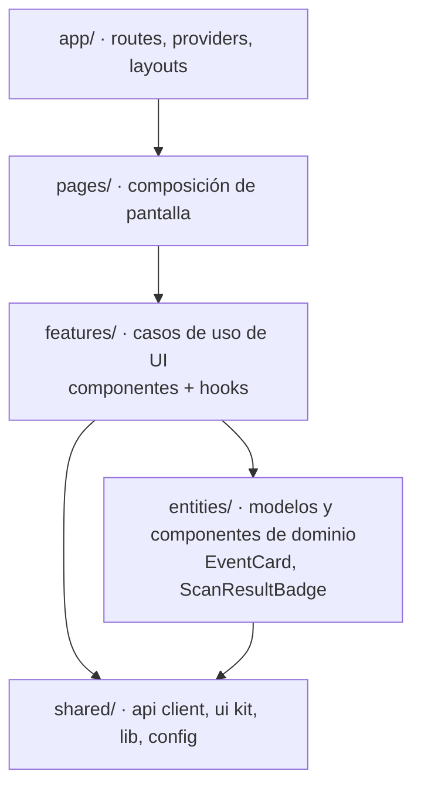
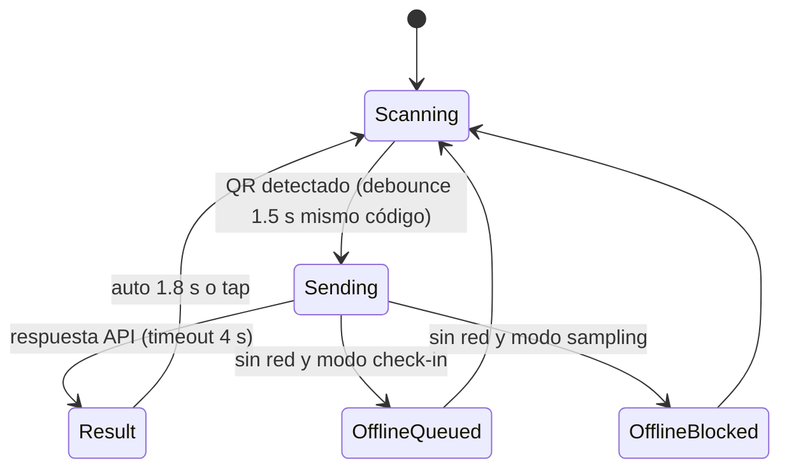

# 05 · Arquitectura Frontend (React)

## 1. Decisiones clave

| Aspecto | Elección | Motivo |
|---------|----------|--------|
| Framework | **React 18 + TypeScript + Vite** (SPA) | Lo pide el proyecto; no se necesita SSR/SEO (apps internas autenticadas). Reemplaza Next.js de la idea original (ADR-002). |
| Aplicaciones | **Una sola app `apps/web`** con dos áreas: `/admin` (dashboard) y `/staff` (PWA) | Comparten UI, cliente HTTP y contratos; code-splitting por ruta mantiene liviana la PWA. |
| Routing | React Router 6 (data routers, `lazy`) | Estándar, soporta loaders y lazy loading. |
| Estado de servidor | **TanStack Query** | Caché, reintentos, invalidación, estados de carga. |
| Estado de cliente | **Zustand** (sesión de staff, modo de escaneo, cola offline en memoria) | Mínimo y sin boilerplate. |
| Persistencia offline | **IndexedDB vía Dexie** | Manifiesto de check-in y cola de escaneos pendientes. |
| PWA | `vite-plugin-pwa` (Workbox) | Instalable, precache del shell, funcionamiento offline. |
| UI | **Tailwind CSS + shadcn/ui** (Radix) | Coherente con la idea original, accesible. |
| Formularios | react-hook-form + zod | Validación tipada, reutiliza esquemas de `packages/contracts`. |
| Gráficos | Recharts | Dashboard en vivo. |
| Lector QR | `@zxing/browser` (o `html5-qrcode`) | Escaneo rápido con cámara trasera. |
| Tiempo real | `EventSource` (SSE) | Unidireccional, simple, reconexión automática. |
| HTTP | `fetch` envuelto en `apiClient` (o `ky`) | Interceptores de token, envelope y errores tipados. |
| i18n | Textos en `shared/i18n/es.ts` | MVP en español, preparado para más idiomas. |
| Testing | Vitest + React Testing Library + MSW; Playwright e2e | — |

## 2. Capas del frontend



| Capa | Responsabilidad | Puede importar |
|------|-----------------|----------------|
| `app/` | Bootstrap, providers (QueryClient, Router, Theme, Auth), layouts, guards de ruta | todo |
| `pages/` | Pantallas: componen features; sin lógica de negocio | features, entities, shared |
| `features/` | Interacciones con valor de negocio: `scan-check-in`, `claim-sampling`, `create-event`, `live-metrics`… Contienen `ui/`, `model/` (hooks, stores), `api/` (queries/mutations) | entities, shared |
| `entities/` | Tipos y componentes de presentación de conceptos de negocio (`event`, `activity`, `registration`, `feedback`) | shared |
| `shared/` | `api/` (cliente HTTP, SSE), `ui/` (shadcn), `lib/` (fechas, formato), `config/`, `i18n/` | nada interno |

**Reglas:**
- Una feature **no importa otra feature**; si dos la necesitan, sube a `entities` o `shared`.
- Los componentes no llaman `fetch` directamente: siempre a través de hooks de `features/*/api` (TanStack Query).
- Tipos de request/response y códigos de error vienen de `@cocacola-ei/contracts` (no duplicar).
- Cada carpeta expone un `index.ts` (API pública); prohibido importar rutas internas de otra slice (regla ESLint `boundaries`).

## 3. Estructura de carpetas

```text
apps/web/
├── public/
│   ├── icons/                     # íconos PWA
│   └── sounds/                    # success.mp3, warning.mp3, error.mp3
├── src/
│   ├── main.tsx
│   ├── app/
│   │   ├── providers/
│   │   ├── router.tsx
│   │   ├── layouts/
│   │   │   ├── AdminLayout.tsx
│   │   │   └── StaffLayout.tsx
│   │   └── guards/                # RequireAdmin, RequireStaff
│   ├── pages/
│   │   ├── admin/
│   │   │   ├── LoginPage.tsx
│   │   │   ├── EventsListPage.tsx
│   │   │   ├── EventDetailPage.tsx       # tabs: resumen, actividades, staff, cupones
│   │   │   ├── EventLivePage.tsx
│   │   │   ├── FeedbackExplorerPage.tsx
│   │   │   ├── ProductsPage.tsx
│   │   │   └── WhatsappSimulatorPage.tsx # solo dev (US-42)
│   │   └── staff/
│   │       ├── StaffLoginPage.tsx
│   │       ├── ModeSelectPage.tsx
│   │       ├── ScannerPage.tsx
│   │       └── ShiftHistoryPage.tsx
│   ├── features/
│   │   ├── auth/
│   │   ├── event-management/
│   │   ├── activity-management/
│   │   ├── staff-access/
│   │   ├── scan-check-in/
│   │   ├── claim-sampling/
│   │   ├── offline-sync/
│   │   ├── live-metrics/
│   │   ├── feedback-explorer/
│   │   └── coupon-report/
│   ├── entities/
│   │   ├── event/
│   │   ├── activity/
│   │   ├── registration/
│   │   ├── feedback/
│   │   └── scan-result/
│   └── shared/
│       ├── api/                   # apiClient.ts, sse.ts, queryKeys.ts, errors.ts
│       ├── ui/                    # componentes shadcn
│       ├── lib/
│       ├── db/                    # Dexie (staff offline)
│       ├── config/                # env.ts (import.meta.env validado con zod)
│       └── i18n/
├── tests/e2e/                     # Playwright
└── vite.config.ts
```

## 4. Rutas

| Ruta | Página | Acceso | Historias |
|------|--------|--------|-----------|
| `/admin/login` | LoginPage | público | US-07 |
| `/admin/events` | EventsListPage | ADMIN | US-01, US-02 |
| `/admin/events/:id` | EventDetailPage | ADMIN | US-03, 04, 06, 08 |
| `/admin/events/:id/live` | EventLivePage | ADMIN | US-32, 33, 29 |
| `/admin/events/:id/feedback` | FeedbackExplorerPage | ADMIN | US-27, 28 |
| `/admin/products` | ProductsPage | ADMIN | US-05 |
| `/admin/analytics` | Comparativo | ADMIN | US-34, 36 |
| `/admin/dev/whatsapp` | WhatsappSimulatorPage | ADMIN + `VITE_ENABLE_DEV_TOOLS` | US-42 |
| `/staff/login` | StaffLoginPage | público | US-09 |
| `/staff/mode` | ModeSelectPage | STAFF | US-10 |
| `/staff/scan` | ScannerPage | STAFF | US-17..22 |
| `/staff/history` | ShiftHistoryPage | STAFF | US-23 |

## 5. PWA de Staff — diseño de la experiencia de escaneo

### 5.1 Flujo de pantalla


### 5.2 Semáforo (mapeo código → UI)
| Código API | Color | Sonido / vibración | Texto principal |
|------------|-------|--------------------|-----------------|
| `CHECK_IN_SUCCESS`, `SAMPLING_CLAIMED` | 🟢 Verde | `success.mp3` / 100 ms | "Bienvenido/a {nombre}" · "Entrega aprobada: {producto} ({n} de {max})" |
| `ALREADY_CHECKED_IN`, `NOT_CHECKED_IN` | 🟡 Amarillo | `warning.mp3` / 2×150 ms | "Ya ingresó a las {hora}" · "Debe pasar por el acceso" |
| `BENEFIT_ALREADY_REDEEMED`, `QR_INVALID`, `QR_WRONG_EVENT`, `REGISTRATION_CANCELLED`, `ACTIVITY_NOT_ALLOWED`, `PRODUCT_NOT_IN_ACTIVITY` | 🔴 Rojo | `error.mp3` / 600 ms | Mensaje del catálogo |
| Offline (check-in encolado) | 🟢 con badge "offline" | `success.mp3` | "Ingreso registrado (pendiente de sincronizar)" |
| Offline (sampling) | ⚪ Gris | `error.mp3` | "Sin conexión: no entregar" |

La pantalla de resultado ocupa todo el viewport, alto contraste y tipografía grande. Debe poder usarse a pleno sol. Los textos vienen del catálogo de errores de `contracts`, no del `message` del servidor, para que funcionen offline.

### 5.3 Offline (solo check-in, ADR-006)
1. Al entrar en modo check-in con red: `GET /scan/offline-manifest?eventId=` → se guarda en Dexie `manifest` (`qrHash`, `firstName`, `status`, `checkInAt`). Se refresca cada 2 min mientras haya red.
2. Sin red: se calcula `qrHash` del token (el token incluye el hash; la firma se valida en el servidor al sincronizar) y se busca en el manifiesto. Se marca localmente como usado y se encola en Dexie `pendingScans` con `clientScanId` y `scannedAt`.
3. Al volver la red (`online` + Background Sync si está disponible): `POST /scan/sync` en lotes de 50. Se muestran los conflictos al promotor.
4. Indicador permanente en el header: 🟢 online · 🟠 offline (N pendientes).

### 5.4 Rendimiento
- Objetivo: **< 1 s** desde la detección del QR hasta el semáforo (p95, online).
- La cámara se mantiene abierta entre escaneos (no se re-inicializa).
- Bundle de `/staff` < 250 KB gzip (sin Recharts ni páginas admin: lazy).

## 6. Admin Dashboard — patrones

- **Queries:** claves centralizadas en `shared/api/queryKeys.ts` (`['events', id]`, `['events', id, 'feedback', filters]`).
- **Mutaciones:** invalidan las claves afectadas; *toasts* con el mensaje del catálogo de errores.
- **Live:** `useEventLive(eventId)` abre SSE, aplica `snapshot` y luego `delta` sobre un store local; reconecta con backoff y vuelve a pedir `snapshot`.
- **Tablas:** paginación por cursor del lado del servidor (TanStack Table).
- **Permisos de UI:** se ocultan acciones no permitidas por estado del evento (tabla de [02 §2.1](./02-logica-de-negocio.md#21-evento-eventstatus)); el backend siempre revalida.

## 7. Autenticación en el cliente
- **Admin:** access token en memoria (Zustand, no `localStorage`), refresh token en cookie `httpOnly; Secure; SameSite=Strict`. `apiClient` reintenta una vez tras `401` llamando a `/auth/refresh`.
- **Staff:** el JWT de staff se guarda en IndexedDB (necesario para operar tras recargar en el recinto). Vida acotada al evento (BR-STF-02); botón "Cerrar turno" lo elimina y limpia Dexie.

## 8. Ejemplo de referencia

```ts
// features/claim-sampling/api/useClaimSampling.ts
export function useClaimSampling() {
  return useMutation({
    mutationFn: (input: SamplingRequestDto) =>
      apiClient.post<SamplingClaimedData>('/scan/sampling', input),
    retry: (count, err) => count < 2 && isNetworkError(err), // mismo clientScanId → idempotente
  });
}
```

```tsx
// features/claim-sampling/ui/SamplingScanner.tsx
export function SamplingScanner() {
  const { activityId, productId } = useScanMode();
  const claim = useClaimSampling();
  const showResult = useScanResultStore((s) => s.show);

  const onDetected = (qrToken: string) =>
    claim.mutate(
      { qrToken, activityId, productId, clientScanId: crypto.randomUUID(), scannedAt: new Date().toISOString() },
      { onSuccess: (r) => showResult(toScanResult(r)), onError: (e) => showResult(toScanResult(e)) },
    );

  return <QrScanner onDetected={onDetected} paused={claim.isPending} />;
}
```

## 9. Testing frontend
| Nivel | Qué | Herramientas |
|-------|-----|--------------|
| Unit | Mapeo código → semáforo, reducers de live metrics, utilidades | Vitest |
| Componentes | Formularios, ScanResult, tablas | RTL + MSW |
| E2E | Login admin → crear evento → publicar; staff login → escanear (cámara simulada con inyección de token) | Playwright contra API con seed |
| Accesibilidad | Contraste y navegación por teclado del admin | `@axe-core/playwright` |
