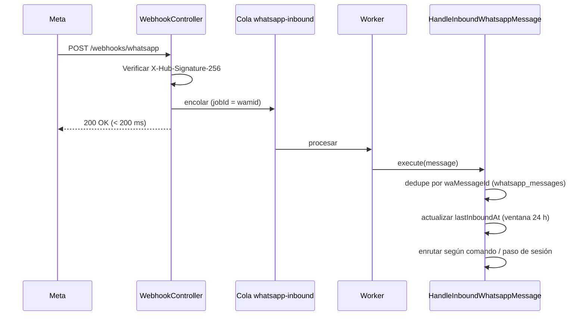
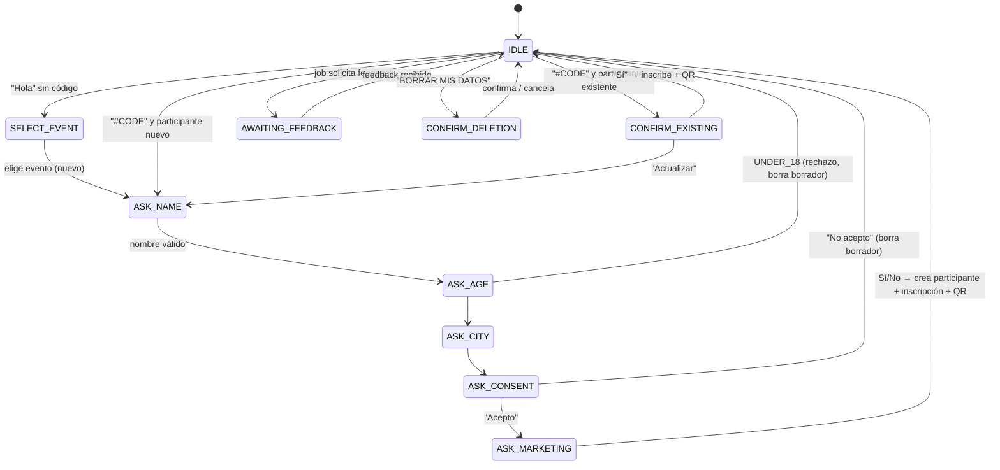
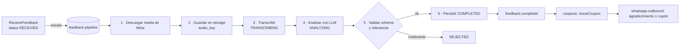

# 08 · WhatsApp e Inteligencia Artificial

## 1. Integración con WhatsApp

### 1.1 Puerto y adaptadores
```ts
// modules/conversations/application/ports/whatsapp.gateway.ts
export interface WhatsappGateway {
  sendText(to: string, body: string): Promise<SentMessage>;
  sendButtons(to: string, body: string, buttons: { id: string; title: string }[]): Promise<SentMessage>; // máx 3
  sendList(to: string, body: string, sections: ListSection[]): Promise<SentMessage>;
  sendImage(to: string, imageUrl: string, caption?: string): Promise<SentMessage>;
  sendTemplate(to: string, template: TemplateName, params: string[]): Promise<SentMessage>;
  downloadMedia(mediaId: string): Promise<{ buffer: Buffer; mimeType: string }>;
}
```
| Adaptador | Uso |
|-----------|-----|
| `MetaCloudWhatsappGateway` | Producción (Graph API `v2x.0/<phone_number_id>/messages`) |
| `ConsoleWhatsappGateway` | Desarrollo/tests: guarda los mensajes en memoria y los expone al simulador (US-42) |
| `TwilioWhatsappGateway` | Alternativa futura (Q-04) |

### 1.2 Recepción (webhook)

- `jobId = wamid` evita duplicados en la cola; el `UNIQUE(wa_message_id)` evita duplicados en DB.
- Los *status updates* (`sent`, `delivered`, `read`, `failed`) actualizan `whatsapp_messages.status`.

### 1.3 Enrutamiento de mensajes entrantes
Orden de evaluación en `HandleInboundWhatsappMessage`:

1. **Comandos globales** (texto normalizado: mayúsculas, sin tildes): `AYUDA`, `MI QR`, `CANCELAR`, `BORRAR MIS DATOS`.
2. **Código de evento** `#XXXX` en el texto → inicia/reanuda registro en ese evento.
3. **Audio** o texto con sesión en `AWAITING_FEEDBACK` → `ReceiveFeedback`.
4. **Paso actual de la sesión** (`ASK_NAME`, `ASK_AGE`, …) → handler del paso.
5. Sin coincidencia → `HELP`.

### 1.4 Máquina de estados del onboarding


- Sesión con **TTL de 24 h** (`expiresAt`); si expira a mitad del registro, se descarta el borrador.
- Máximo **3 reintentos** por paso con respuesta inválida; luego se envía `HELP` y se resetea a `IDLE`.
- Rango de edad: mensaje de **lista interactiva** (5 opciones). Consentimiento y marketing: **botones** (máx 3 por mensaje según Meta).

### 1.5 Plantillas (mensajes iniciados por la empresa fuera de la ventana de 24 h)
Deben aprobarse en Meta Business Manager antes de producción.

| Nombre | Categoría Meta | Uso | Parámetros |
|--------|----------------|-----|------------|
| `feedback_request_v1` | UTILITY | Solicitud de feedback (BR-FBK-03) | `{{1}}` nombre, `{{2}}` evento |
| `event_cancelled_v1` | UTILITY | Cancelación de evento (BR-EVT-05) | nombre, evento |
| `event_reminder_v1` | UTILITY | Recordatorio el día del evento (futuro) | nombre, evento, hora |
| `event_changed_v1` | UTILITY | Cambio de fecha/lugar | nombre, evento, detalle |

### 1.6 Imagen del QR
- Contenido del QR: el **token** (`cei1.<registrationId>.<firma>`, ver [09 §3](./09-seguridad-y-privacidad.md#3-tokens-qr)).
- Render: librería `qrcode` → PNG 600×600, corrección de errores `M`, con margen; opcionalmente marco con branding y nombre del evento (`sharp`).
- Se sube a storage privado y se envía por URL firmada (validez 10 min, suficiente para que Meta la descargue).

---

## 2. Pipeline Audio-to-Insights



### 2.1 Puertos de IA
```ts
export interface SpeechToText {
  transcribe(audio: Buffer, mimeType: string, opts: { language: 'es' }): Promise<{ text: string; durationSec?: number; model: string }>;
}
export interface FeedbackAnalyzer {
  analyze(input: FeedbackAnalysisInput): Promise<{ result: FeedbackAnalysis; model: string; promptVersion: string; usage: TokenUsage }>;
}
```
Adaptadores: `OpenAiWhisperSpeechToText` (modelo por env `STT_MODEL`, default `whisper-1`), `OpenAiFeedbackAnalyzer` (`LLM_MODEL`, default `gpt-4o-mini`). Los modelos son configurables para poder cambiar de proveedor o versión sin tocar la lógica (ADR-007).

### 2.2 Esquema de salida (fuente de verdad: `packages/contracts/src/feedback-analysis.schema.ts`)
```ts
import { z } from 'zod';

export const FeedbackAnalysisSchema = z.object({
  isRelevant: z.boolean()
    .describe('true si habla de la experiencia del evento o de productos; false si es ruido, broma o tema ajeno'),
  sentimentScore: z.number().int().min(1).max(5)
    .describe('1 muy negativo, 3 neutral, 5 muy positivo'),
  likesProduct: z.boolean().describe('Le gustó el producto que probó'),
  purchaseIntent: z.boolean().describe('Expresa que lo compraría o lo incorporaría a su consumo habitual'),
  productsMentioned: z.array(z.string()).describe('Productos mencionados, normalizados al catálogo provisto'),
  flavorAttributes: z.array(z.string()).max(8).describe('Ej: "refrescante", "menos dulce", "gas perfecto"'),
  keyTopics: z.array(z.enum(['sabor', 'temperatura', 'dulzor', 'gas', 'precio', 'música', 'filas', 'staff',
    'ambiente', 'actividades', 'organización', 'otro'])).max(6),
  experienceHighlights: z.array(z.string()).max(3).describe('Lo que más disfrutó'),
  painPoints: z.array(z.string()).max(3).describe('Quejas o aspectos a mejorar'),
  executiveQuote: z.string().max(200).describe('Cita breve y fiel, corregida solo en ortografía'),
  language: z.string().describe('Código ISO 639-1 detectado'),
});
export type FeedbackAnalysis = z.infer<typeof FeedbackAnalysisSchema>;
```
Mapeo a columnas: `sentimentScore`, `likesProduct`, `purchaseIntent`, `isRelevant`, `keyTopics`, `executiveQuote` → columnas; el objeto completo + `model` + `promptVersion` + `usage` → `ai_metadata`.

### 2.3 Prompt (versionado: `prompts/feedback-analysis.v1.ts`)
```text
Eres analista de Consumer Insights de The Coca-Cola Company.
Recibirás la transcripción de una nota de voz espontánea de una persona que asistió al evento "{eventName}".
Productos que se degustaron en el evento: {productList}.

Reglas:
- Analiza SOLO lo que la persona dice; no inventes información.
- sentimentScore refleja la emoción global hacia la experiencia y los productos.
- purchaseIntent = true solo si hay una manifestación explícita o claramente implícita de compra o consumo futuro.
- Normaliza productsMentioned a los nombres de la lista de productos; ignora marcas de la competencia.
- executiveQuote debe ser una frase literal de la transcripción (puedes recortarla), sin datos personales.
- Si la transcripción no trata del evento o de los productos, isRelevant = false.
- Modismos locales (ej. chilenismos) son válidos: "bacán", "la raja" = muy positivo; "fome" = negativo.
```
- Se ejecuta con **Structured Outputs** (`response_format` con JSON Schema estricto) y `temperature: 0`.
- Se valida además con zod (defensa en profundidad); fallo → reintento.
- Cambiar el prompt = nueva versión (`v2`) + correr la suite de fixtures (ver §2.6).

### 2.4 Implementación de referencia (Node / NestJS)
```ts
@Injectable()
export class OpenAiFeedbackAnalyzer implements FeedbackAnalyzer {
  constructor(private readonly openai: OpenAI, private readonly config: AiConfig) {}

  async analyze(input: FeedbackAnalysisInput) {
    const completion = await this.openai.chat.completions.parse({
      model: this.config.llmModel,
      temperature: 0,
      messages: [
        { role: 'system', content: buildFeedbackPromptV1(input.eventName, input.productNames) },
        { role: 'user', content: input.transcription },
      ],
      response_format: zodResponseFormat(FeedbackAnalysisSchema, 'feedback_analysis'),
    });
    const parsed = completion.choices[0].message.parsed;
    if (!parsed) throw new AiInvalidOutputError(completion.choices[0].message.refusal);
    return {
      result: FeedbackAnalysisSchema.parse(parsed),
      model: completion.model,
      promptVersion: 'v1',
      usage: completion.usage,
    };
  }
}
```

### 2.5 Reglas operativas del pipeline
| Aspecto | Valor |
|---------|-------|
| Validación previa | duración 3–90 s, tamaño ≤ 16 MB, MIME permitido (BR-FBK-04) |
| Timeout por llamada | STT 60 s, LLM 30 s |
| Reintentos | 3 con backoff (BR-FBK-09); `attempts` y `lastError` en `feedback` |
| Concurrencia del worker | 5 jobs (configurable `FEEDBACK_CONCURRENCY`) |
| Respuesta inmediata al usuario | "¡Recibido! 🎧" al encolar; agradecimiento/cupón al completar |
| Costo | Registrar `usage` en `ai_metadata`; métrica de costo por evento |
| PII | No enviar teléfono ni nombre completo al LLM; solo transcripción, nombre del evento y productos |

### 2.6 Calidad del análisis
- `test/fixtures/feedback/*.json`: ≥ 30 transcripciones reales/sintéticas etiquetadas a mano (positivas, negativas, neutras, irrelevantes, con modismos, con intención de compra ambigua).
- Test `@slow` que corre el analizador real y exige: exactitud de `sentimentScore` ±1 en ≥ 90 %, `purchaseIntent` exacto en ≥ 85 %, `isRelevant` exacto en ≥ 95 %.
- Revisión manual mensual de una muestra en el Feedback Explorer.

---

## 3. Notificaciones salientes (cola `whatsapp-outbound`)
| Disparador | Mensaje | Tipo |
|------------|---------|------|
| `registration.created` | `REGISTERED` + imagen QR | sesión (dentro de 24 h) |
| `feedback.requested` | `FEEDBACK_REQUEST` o plantilla `feedback_request_v1` | según ventana |
| `feedback.completed` sin cupón | `FEEDBACK_THANKS` | sesión |
| `coupon.issued` | `FEEDBACK_THANKS_COUPON` | sesión |
| `event.status_changed → CANCELLED` | plantilla `event_cancelled_v1` | plantilla |

Límite de envío: respetar el *tier* de mensajería de la cuenta de Meta; la cola usa `limiter: { max: 60, duration: 1000 }` (ajustable).
