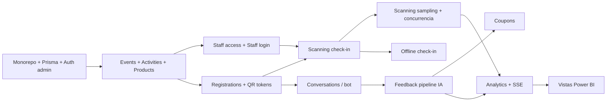

# 11 · Roadmap y Backlog

La idea original planteaba 4 días de desarrollo (formato hackathon/demo). Este roadmap mantiene esas 4 fases, pero las dimensiona para un **MVP productivo** en sprints de 1 semana. Si el objetivo es una demo, usar la columna "Atajo demo".

## 1. Fases

| Fase | Objetivo | Historias | Entregable | Atajo demo |
|------|----------|-----------|------------|------------|
| **0 · Fundaciones** (Sprint 0) | Monorepo, CI, DB, auth base | US-40, US-41, US-07 | `pnpm dev` levanta API + web + Postgres + Redis; seed; login admin | Igual |
| **1 · Gestión de eventos** (Sprint 1) | Admin configura todo un evento | US-01…06, US-08 | Crear evento → actividades → productos → staff → publicar | Sin campañas de cupón (hardcode) |
| **2 · Operación en terreno** (Sprints 2–3) | PWA staff con check-in y sampling antifraude | US-09, 10, 17, 18, 21, 22, 23 → luego US-19, 20 | Escaneo con semáforo < 1 s; test de concurrencia en verde | Sin offline (US-19) ni búsqueda manual |
| **3 · WhatsApp + IA** (Sprints 4–5) | Registro conversacional, QR, feedback por voz, cupones | US-11…16, 24…27, 30, 37, 38, 42 | Viaje completo del participante en WhatsApp sandbox | Simulador (US-42) en vez de Meta real |
| **4 · Analítica** (Sprint 6) | Dashboard en vivo + Power BI | US-28, 29, 31, 32…36, 39 | Panel SSE + vistas `analytics` + reporte Power BI | Solo panel en vivo |
| **5 · Endurecimiento** (Sprint 7) | Listo para evento real | — | Pruebas de carga, revisión de seguridad, plantillas Meta aprobadas, runbook | — |

## 2. Orden de implementación sugerido (dependencias)

> Para probar el escaneo antes de tener el bot, el seed crea inscripciones y un endpoint dev `GET /dev/registrations/:id/qr` devuelve el PNG del QR.

## 3. Checklist por sprint

### Sprint 0 — Fundaciones
- [ ] Monorepo pnpm + Turborepo (`apps/api`, `apps/web`, `packages/contracts`, `packages/eslint-config`, `packages/tsconfig`)
- [ ] `docker-compose.yml` con Postgres 16 y Redis 7
- [ ] NestJS: config validada, Prisma, pino, filtro de errores, envelope, health
- [ ] `schema.prisma` de [06](./06-modelo-de-datos.md) + migración inicial + restricciones SQL
- [ ] Seed (US-41)
- [ ] React + Vite + Tailwind + shadcn + router + QueryClient
- [ ] Login admin end-to-end
- [ ] CI: lint, typecheck, test unit, test e2e (Testcontainers), build

### Sprint 1 — Eventos
- [ ] Módulos `events`, `catalog`, `auth` (staff accesses)
- [ ] Pantallas: listado, detalle con tabs, formularios
- [ ] Job `EventLifecycleJob`

### Sprints 2–3 — Escaneo
- [ ] Tokens QR (firma/verificación) + tests de rotación
- [ ] `CheckInAttendee`, `ClaimActivityBenefit` + idempotencia
- [ ] Test de concurrencia (`Promise.all` de 10 claims → 1 éxito)
- [ ] PWA: login staff, selector de modo, escáner, semáforo, sonidos, historial
- [ ] Manifiesto offline + cola Dexie + `/scan/sync`
- [ ] Prueba en dispositivos reales (Android gama media + iPhone) a pleno sol

### Sprints 4–5 — WhatsApp + IA
- [ ] `WhatsappGateway` (Meta + Console), webhook con firma, colas
- [ ] Máquina de estados de onboarding + comandos
- [ ] Render y envío de QR
- [ ] `FeedbackRequestJob`, `ReceiveFeedback`, pipeline STT + LLM, fixtures de calidad
- [ ] Cupones + mensajes
- [ ] Anonimización + purga de audios
- [ ] Simulador de WhatsApp en admin

### Sprint 6 — Analítica
- [ ] `GET /events/:id/metrics`, timeseries, SSE con Redis Pub/Sub
- [ ] Panel en vivo (Recharts), Feedback Explorer, reporte de cupones
- [ ] Migración SQL de vistas `analytics` + rol `bi_reader`
- [ ] Reporte Power BI de referencia (.pbix fuera del repo; documentar conexión)

### Sprint 7 — Endurecimiento
- [ ] Prueba de carga: 50 escaneos/s sostenidos durante 10 min, p95 < 300 ms en API (k6)
- [ ] 1000 webhooks/min sin pérdida
- [ ] Revisión de seguridad ([09](./09-seguridad-y-privacidad.md)) y de privacidad
- [ ] Runbook de evento: checklist pre-evento, contacto de soporte, qué hacer si cae la red/IA/WhatsApp

## 4. Definición de Hecho (DoD)
Una historia está **hecha** cuando:
1. Cumple todos sus criterios de aceptación (Gherkin) con test automatizado (unit/e2e según corresponda).
2. Las reglas `BR-xxx` que toca tienen test unitario nombrado con su ID.
3. Contratos actualizados en `packages/contracts` y OpenAPI; [07](./07-contratos-api.md) actualizado si cambió un endpoint o código.
4. Lint, typecheck y tests en verde en CI.
5. Sin PII en logs; textos de usuario en el catálogo de mensajes/i18n.
6. Documentación de `docs/` actualizada si cambió una regla, flujo o decisión.
7. Revisada por otra persona (o por `/code-review`).

## 5. Riesgos

| Riesgo | Prob. | Impacto | Mitigación |
|--------|-------|---------|------------|
| Aprobación de número/plantillas de Meta tarda | Alta | Alto | Iniciar trámite en Sprint 0; simulador para desarrollar |
| Sin señal en el recinto | Media | Alto | Check-in offline; router 4G dedicado para stands de sampling |
| Calidad del análisis IA con modismos/ruido | Media | Medio | Fixtures locales, prompt con modismos, revisión humana |
| Costo de IA en eventos masivos | Baja | Medio | `gpt-4o-mini`, límites de duración, métrica de costo por evento |
| Sesgo por cupón condicionado (Q-02) | Alta | Medio | Decisión de negocio; recomendado `ANY_VALID_FEEDBACK` |
| Normativa de datos (audio de voz) | Media | Alto | Retención 30 días, consentimiento explícito, revisión legal |
