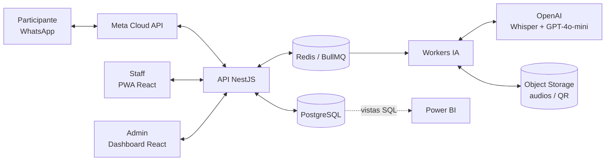

# 📚 Documentación — Coca-Cola Event Intelligence

Documentación funcional y técnica del proyecto. Es la **fuente de verdad** para el desarrollo: cualquier cambio de reglas de negocio, contratos o arquitectura debe reflejarse aquí **antes** (o junto) del cambio en el código.

> La idea original del producto está en [`../COCA_COLA_EVENT_INTELLIGENCE.md`](../COCA_COLA_EVENT_INTELLIGENCE.md). Estos documentos la **refinan y, cuando hay conflicto, la reemplazan** (ver [ADRs](./13-decisiones-de-arquitectura.md)).

## Índice

| # | Documento | Contenido | Úsalo cuando… |
|---|-----------|-----------|---------------|
| 01 | [Visión y alcance](./01-vision-y-alcance.md) | Problema, objetivos, KPIs, alcance MVP / fuera de alcance, actores | Necesites contexto del producto |
| 02 | [Lógica de negocio](./02-logica-de-negocio.md) | Dominio, máquinas de estado, reglas `BR-xxx`, políticas configurables | Implementes cualquier caso de uso |
| 03 | [Historias de usuario](./03-historias-de-usuario.md) | Épicas, historias `US-xxx` con criterios de aceptación (Gherkin) | Planifiques o pruebes una funcionalidad |
| 04 | [Arquitectura backend (NestJS)](./04-arquitectura-backend-nestjs.md) | Capas, módulos, estructura de carpetas, ejemplos de código | Escribas código del API |
| 05 | [Arquitectura frontend (React)](./05-arquitectura-frontend-react.md) | Admin Dashboard + PWA Staff, capas, rutas, offline | Escribas código del frontend |
| 06 | [Modelo de datos](./06-modelo-de-datos.md) | ERD, `schema.prisma` definitivo, índices, restricciones | Toques la base de datos |
| 07 | [Contratos de API](./07-contratos-api.md) | Endpoints REST, envelope, catálogo de códigos de error | Conectes front ↔ back |
| 08 | [WhatsApp e IA](./08-whatsapp-e-ia.md) | Bot conversacional, pipeline Audio-to-Insights, colas | Trabajes en el bot o la IA |
| 09 | [Seguridad y privacidad](./09-seguridad-y-privacidad.md) | Auth, RBAC, QR firmados, antifraude, retención de datos | Toques auth, QR o datos personales |
| 10 | [Analítica y Power BI](./10-analitica-power-bi.md) | Definición de métricas, vistas SQL corregidas, DAX | Construyas dashboards o reportes |
| 11 | [Roadmap y backlog](./11-roadmap-y-backlog.md) | Fases, sprints, orden de historias, definición de hecho | Decidas qué hacer a continuación |
| 12 | [Guía de desarrollo](./12-guia-de-desarrollo.md) | Monorepo, setup local, variables de entorno, convenciones, testing, git | Empieces a programar |
| 13 | [Decisiones de arquitectura (ADR)](./13-decisiones-de-arquitectura.md) | Registro de decisiones y su justificación | Quieras cambiar una decisión |
| 14 | [Glosario](./14-glosario.md) | Términos de negocio y técnicos | Dudes de un término |
| 15 | [Diseño frontend](./15-diseno-frontend.md) | Referencias, alcance y validación de la demo | Revises esta primera implementación |

## Convenciones de esta documentación

- **IDs estables:** reglas de negocio `BR-<área>-<n>`, historias `US-<n>`, épicas `EP-<n>`, decisiones `ADR-<n>`, errores `UPPER_SNAKE_CASE`. El código y los tests deben referenciar estos IDs (ej. `// BR-SAM-02`).
- **Idioma:** documentación y textos de usuario en español; código (identificadores, commits) en inglés.
- **Preguntas abiertas:** se marcan con `❓ PENDIENTE` y se listan al final de [02-logica-de-negocio.md](./02-logica-de-negocio.md#9-preguntas-abiertas). No se implementa una regla pendiente sin decisión explícita; se usa el valor por defecto documentado.

## Mapa rápido del sistema

